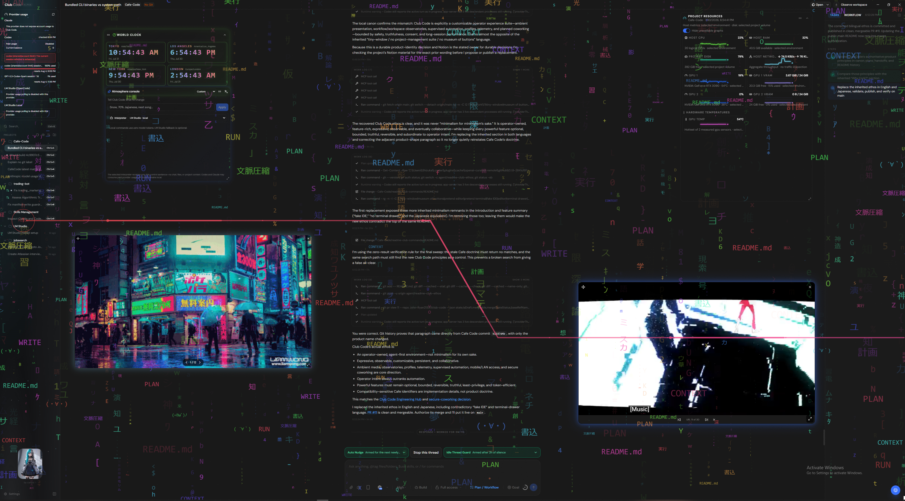

# Club Code

### Cafe Code, after hours



Made in Japan with love, too much glitter, and absolutely no chance of catching the last train.

**Warning**: Large parts of the application are currently under development and have been completely rewritten. It may take some time for the system to become stable.

_Heeey, darling. Come in, come in. Closer. I am not shouting; the room is just very far away. Club Code is the late-night fork of Cafe Code: chat goes in, work comes back, and nobody drags a fake IDE onto my dance floor. Snow in the window? Yes. A little movie in the corner? Yes. One more glass? Also yes. That one is probably unrelated._

This repository is **Club Code**, an after-hours fork of [Cafe Code](https://github.com/cafeai/cafe-code), which began as a fork of [T3 Code](https://github.com/pingdotgg/t3code). The app still uses Cafe Code package, command, and data-directory names for compatibility. New sign outside; dependable regulars behind the bar.

It stays small, quick, and out of the way. No freezing, no dragging, no enormous dashboard getting sleepy on your shoulder.

T3 Code wanted to be minimal. Cafe Code went smaller. Club Code put on nicer lights without making the room heavier.

No terminal drawer. No pretend IDE. No giant dashboard wearing a useful-looking hat. If you want a console, use a real console. If you want to inspect code, open it in VS Code.

<p align="center">
  
</p>

## Tonight’s Very Sensible Menu

Listen, gorgeous, I wrote this down before the second bottle, so it is accurate. The new atmosphere and media effects start off. The coding chat remains the main table; the sparkle never gets to steal your mouse, your prompt, or your tokens.

- **Snow, rain, or Matrix across the whole window:** Pick one, turn it off again, choose the color, transparency, and speed. It floats over the entire app but is pointer-transparent, motion-aware, bounded, and polite. Much cooler. Still not allowed to interrupt your typing.
- **Your image or GIF in the corner:** Upload a validated PNG, JPEG, WebP, or GIF; start it in either lower corner, choose glow or no glow, and small, medium, large, or custom. Custom mode drags and resizes with the mouse or keyboard. If a video wants the same corner, the image stacks above it with a tidy 12 px gap; the image steps down in size or moves to the free side instead of wrestling in public. Animated GIF work pauses when reduced motion, visibility, or focus policy says it should.
- **YouTube without surrendering the room:** Paste a video or public-playlist URL, use the optional server-gated in-app public search, float the player in either corner, or enter Cinema mode. Cinema keeps the project rail on the left, gives the video the center, and moves chat into a right rail; the same player survives project, route, and layout changes. Native player fullscreen is still available. On a configured local desktop backend, the owner can connect a YouTube account to browse owned playlists; the PKCE grant lives only in that owner session's memory and dies on disconnect, expiry, or restart. It is not remote-web OAuth, Premium login, or a promise that a private playlist can play in the iframe. Club Code never sees YouTube Premium credentials and does not extract YouTube audio for visualizers.
- **Spotify, but only the official little velvet rope:** Paste a supported Spotify track, album, artist, playlist, show, or episode URL/URI and Club Code normalizes it to an official Spotify Embed iframe. It stores only the validated entity type and ID, never pasted query crumbs. Spotify's own player handles login and playback; Club Code does not promise Premium iframe login, DRM miracles, PCM access, or Spotify-synchronised visuals.
- **Local Media, for the file already in your hand:** Choose one browser-supported audio or video file. It is a current-document `blob:` URL only—no path, filename, bytes, or choice goes to settings, logs, or the server. Club Code revokes the URL when you clear or replace it; closing or refreshing the document releases whatever remains. Put it floating in a lower corner, drag/resize it in Custom, give it the Cinema chat-rail treatment, or (video only) use a readable pass-through background veil. The tiny optional visualizer is bounded and listens only to that selected local HTML media element. It is not libVLC, projectM, YouTube/Spotify PCM, system audio, a network stream, or a universal-codec promise. Very cute boundary. Do not climb over it in heels.
- **Workflow Observatory:** See plans, tools, lifecycle state, and provider-reported sub-agents working in a local, bounded view. Presentation state stays out of prompts and model context, so watching the kitchen does not make the agents eat more tokens. Look at them go. Busy little geniuses. I am emotional.
- **Whole-window opacity:** The Electron bridge and preference are implemented. The one-action appearance reset switches off persisted atmosphere, streaming/image panels, and native opacity, then clears current-session Local Media so its playback and visualizer work stop; saved ambient sources and choices stay waiting for another night. The packaged Windows path has native-smoke evidence; other platforms stay fail-closed until their own artifact earns it. A browser will never pretend it can make a native window transparent, and this is whole-window fading—not KDE/Konsole-style compositor acrylic.
- **LM Studio through Codex:** Turn on **LM Studio mode** and Club Code launches `codex --oss --local-provider lmstudio app-server`, skips cloud login checks, and uses the models discovered from the LM Studio-compatible server on `localhost:1234`. Local and cloud model catalogs stay separate. LM Studio itself remains external and is not bundled.
- **The serious future-native menu:** A separate Electron libVLC/projectM experiment is still conditional on native packaging, security, performance, and licensing gates. The shipped Local Media player above is browser-native HTML5, not that experiment. There is no browser VLC plugin, Spotify-synchronised visualizer, YouTube/Spotify PCM extraction, or promise that DRM streams and every codec will work. I may be tipsy; the README is not allowed to lie.

### Turn On the New Toys

Atmosphere, image/GIF, streaming, Local Media, and opacity controls live under **Settings → Appearance** when the connected server and desktop expose the matching capability. Workflow lives in the **Plan | Workflow** panel, where it can remain honest about unavailable provider detail.

Public YouTube search keeps its Data API key on the server. Enable both values before launching the backend:

```bash
CAFE_CODE_YOUTUBE_PUBLIC_DISCOVERY_ENABLED=true
CAFE_CODE_YOUTUBE_API_KEY=your_server_only_key
```

Owned-playlist discovery is deliberately desktop-local and stays off unless both of these are configured before launching the local backend:

```bash
CAFE_CODE_YOUTUBE_ACCOUNT_CONNECTION_ENABLED=true
CAFE_CODE_YOUTUBE_OAUTH_DESKTOP_CLIENT_ID=your-desktop-client.apps.googleusercontent.com
```

Enable the YouTube Data API, complete Google's consent-screen setup, and use a Desktop OAuth client ID. Club Code uses Google's Desktop-app loopback form, `http://127.0.0.1:<Cafe Code backend port>`, with the backend's actual port and no added path. The grant is per owner session and memory-only—no refresh token is written at rest—and remote-web backends do not expose this connection flow.

For LM Studio, start its local API server on `localhost:1234`, then enable **LM Studio mode** in the Codex provider settings. Cloud login is not required for that local mode.

Capability gates, operating-system support, native smoke tests, licensing, packaging, performance, and security reviews still decide what is exposed in a release. A sparkly sign is not a release commitment. Mm. Responsible.

## Why Fork?

Because the app should stay small, fast, and predictable.

Bug fixes are welcome. Performance fixes are welcome. Reliability fixes are
welcome. Security fixes are extra welcome.

Feature requests need to pass the tiny-window test: does this make Cafe Code
smaller, calmer, faster, easier to understand, lower CPU, lower memory, or less
annoying when something fails?

If yes, maybe.

If it turns Cafe Code into a pretend IDE, a pretend terminal, a release
dashboard, a project-management suite, or a museum of buttons, no.

## What Changed From T3 Code

This is the practical working list. It will probably get cleaned up later.

- Completely rewrote the lifecycle system to be more inline with Codex and Claude.
- Numerous bug fixes.
- Excessive debugging information.
- Rebranded the app around Cafe Code.
- Moved local app data into `~/.cafe-code`.
- Removed the in-app terminal drawer and terminal UI.
- Removed hosted web-app assumptions and focused the project on the Electron app.
- Disabled update checks until Cafe Code has its own release path.
- Added a queue/follow-up workflow for prompts sent while a provider is running.
- Added provider-aware queue actions: steer when supported, interrupt when that
  is the honest behavior.
- Added thread moving between project folders and working directories.
- Added "Move to Recycle Bin", "Recently Deleted", restore, permanent delete,
  and empty recycle bin flows.
- Added a default editor setting for VS Code, Antigravity, Finder, or system
  default.
- Made file-change rows and path pills open real paths instead of truncated
  display text.
- Added a localhost-only debug endpoint behind `--cafe-debug`.
- Reduced needless Git polling and checkpoint churn.
- Hardened hidden checkpoint handling, ignored-file capture, and old ref pruning.
- Fixed provider/session edge cases around reconnects, stale running state,
  resume metadata, and null checkpoint timestamps.
- Removed or hid features that do not belong in a minimal coding-agent shell.

## Run From Source

For this fork, the dependable path documented here is a source checkout.
Packaging support and native-smoke evidence are not the same thing as a signed,
published installer; this README does not promise a DMG, updater, notarized
bundle, or "drag this into Applications" ceremony.

The npm package exists, but do not treat it as the fresh install path yet. It
will probably be out of date until Cafe Code settles down a little more. The app
is in pretty good shape now, but the fastest-moving build is still the repo
itself.

Mostly tested on macOS. Windows seems to work. Linux may need a little tweaking;
I have not had enough time on it yet.

Install Node.js 24.13.1 and Corepack, then run Club Code from a checkout. The
repository pins the exact Yarn release through Corepack:

```bash
git clone https://github.com/John-Ryan21337/club-code.git
cd club-code
corepack enable
yarn install --immutable
yarn build:desktop
yarn workspace @cafecode/desktop start
```

Debug mode:

```bash
yarn workspace @cafecode/desktop start --cafe-debug
```

### Browser Web UI Firewall Ports

If you want to open the Cafe Code Web UI from another device on your LAN, first
enable network/LAN access in Cafe Code, then allow the desktop backend ports
through your firewall. The default desktop ports are:

- HTTPS/WSS Web UI: `3775/tcp`
- HTTP/WS fallback and certificate bootstrap page: `3773/tcp`

For `ufw`:

```bash
sudo ufw allow 3775/tcp comment 'Cafe Code HTTPS'
sudo ufw allow 3773/tcp comment 'Cafe Code HTTP'
```

For local development with `yarn dev:desktop`, the default ports are:

```bash
sudo ufw allow 13775/tcp comment 'Cafe Code dev HTTPS'
sudo ufw allow 13773/tcp comment 'Cafe Code dev backend'
sudo ufw allow 5733/tcp comment 'Cafe Code dev Vite'
```

If Cafe Code prints a different port, or you run with `CAFE_CODE_PORT`,
`CAFE_CODE_HTTPS_PORT`, `CAFE_CODE_DEV_INSTANCE`, or
`CAFE_CODE_PORT_OFFSET`, allow the printed port instead.

### Saved Remote Servers

The Connections settings can save direct connections to other reachable Cafe
Code servers using a pairing URL or a host plus pairing code. Cafe Code scopes
projects, threads, providers, and live subscriptions to the selected server.

Cafe Code does not create SSH or Tailscale tunnels. Configure the network,
certificate, firewall, or reverse proxy separately, then use the server's
pairing details. Desktop credentials are encrypted with Electron safe storage;
browser credentials are retained only for the current browser session.

If you want Codex or Claude to do it for you, paste this into the CLI:

```text
Install Club Code from source. Clone https://github.com/John-Ryan21337/club-code.git, install Node.js 24.13.1 and Corepack, run corepack enable, run yarn install --immutable, run yarn build:desktop, then start it with yarn workspace @cafecode/desktop start. Also verify Codex CLI is installed and logged in with codex login, and Claude Code is installed and logged in with claude auth login if I want Claude support.
```

The old npm path is still here for later, but it may lag behind current work:

```bash
npx @cafeai/cafe-code
npm install -g @cafeai/cafe-code
cafe-code
```

Cafe Code expects at least one provider to already be installed and
authenticated:

- Codex: install [Codex CLI](https://developers.openai.com/codex/cli) and run `codex login`
- Claude: install [Claude Code](https://claude.com/product/claude-code) and run `claude auth login`
- OpenCode: install [OpenCode](https://opencode.ai/docs/) and configure at least one upstream provider, or configure Cafe Code with an existing OpenCode server URL

Cafe Code currently ships Codex, Claude, and OpenCode provider integrations.

## Local Development

Run the app from a checkout:

```bash
yarn install --immutable
yarn start:desktop
```

Run the desktop package directly:

```bash
yarn workspace @cafecode/desktop start
```

Debug mode:

```bash
yarn start:desktop:debug
```

The app prints a localhost-only debug URL on startup.

Useful checks:

```bash
yarn fmt
yarn lint
yarn typecheck
yarn test
```

### Local Arch Package

Build a local pacman package from the Linux AppImage artifact:

```bash
yarn install --immutable
yarn dist:arch:local
sudo pacman -U release/arch/cafe-code-*.pkg.tar.zst
```

To build and install in one step:

```bash
yarn dist:arch:local --install
```

This helper builds a package from the current checkout and does not publish
anything.

### AUR Source Package

The `cafe-code` AUR target compiles Cafe Code from source and then packages the
locally built AppImage. On Arch Linux, build it with:

```bash
yarn dist:aur:cafe-code
```

The package is written to `packaging/aur/cafe-code/`. Its `PKGBUILD`, generated
`.SRCINFO`, launcher, desktop entry, and packaging license are kept in that
directory so it can also be used as the contents of the standalone AUR Git
repository.

To create the initial AUR listing, first create an AUR account and add your SSH
public key. Then submit the package metadata:

```bash
git clone ssh://aur@aur.archlinux.org/cafe-code.git ../aur-cafe-code
cp -a packaging/aur/cafe-code/. ../aur-cafe-code/
cd ../aur-cafe-code
makepkg --printsrcinfo > .SRCINFO
git add .gitignore .SRCINFO LICENSE PKGBUILD cafe-code.desktop cafe-code.sh
git commit -m "Initial cafe-code package"
git push
```

The current recipe uses the immutable published commit for version `0.0.51`
because that version has no matching Git tag. For future releases, update
`pkgver`, reset `pkgrel` to `1`, update the source commit and checksum, and
regenerate `.SRCINFO` before pushing the AUR repository.

### Debian Package

Build a Debian package for the host architecture:

```bash
yarn install --immutable
yarn dist:desktop:deb
```

Explicit architecture targets are also available:

```bash
yarn dist:desktop:deb:x64
yarn dist:desktop:deb:arm64
```

The package is written to `release/`. Install the emitted file with your
graphical package installer or with `sudo apt install ./release/<file>.deb`.

## 日本語でも、もう一杯。え、もう一杯？

いらっしゃぁ〜い、Club Code へようこそぉ。ね、こっち座って。もっとこっち。
あたし全然酔ってないよ？　シャンパン三杯と、たぶん Git の差分を一杯飲んだだけ。
終電？　あれはもう行った。だいじょうぶ、歌舞伎町の午前三時には、終電は概念だから。お水どこ？

Club Code は Cafe Code の深夜版 fork なの。中の package 名とか command とか
`.cafe-code` は互換性のため、そのまま Cafe Code。看板だけ Club Code。
新しいお店なのに常連さんのボトルは消さない、そういう気づかい。えらくない？　えらい。乾杯。

Codex と Claude と OpenCode が、ちゃんとコードの仕事をするための小さいデスクトップアプリ。
ターミナルのふりもしないし、IDE のふりもしないし、巨大 dashboard が急に
「わたし仕事できます」みたいな顔で座ってこない。コードは VS Code、本物の console は本物の console。
ここは chat と agent の仕事を見る席。小さいのに働く。あたしより働く。そこ比べなくていいからぁ。

ねぇ聞いて、ここからすごいよ。ちゃんとメモしたから、酔ってても仕様は正確。

- **雪・雨・Matrix 文字**をウィンドウ全部に降らせられるの。色も透明度も速さも選べて、もちろん off もある。クリックは奪わないし、動きすぎないよう上限もある。仕事の邪魔をせずに画面だけ急にかっこいい。ね、天才。もう一回見せて。
- **手元の画像/GIF**は、まず左下か右下。small / medium / large、それから mouse と keyboard で動かして resize できる custom。縁をふわっと光らせてもいい。同じ角に YouTube が来たら、その上へ 12 px だけ上品に空けて並ぶし、狭かったら画像だけ小さくなるか空いてる角へ行く。喧嘩しない。あたしたちより大人。GIF は reduced motion、非表示、focus、background animation の設定を守って休むから、目と CPU も朝まで働かされない。
- **YouTube**は URL や公開 playlist を入れて、左右に浮かべるか Cinema へ。Cinema では project sidebar が左、video が真ん中、chat が右。project や route を変えても player をむやみに作り直さないし、player 本来の fullscreen も使える。server に API key を入れた時だけ、認証済みのアプリ内公開検索も出る。local desktop backend を設定した owner だけは自分の playlist を見るために account をつなげるけど、token はその owner session の memory だけ、restart/切断で消える。remote web OAuth でも Premium login でもない。Premium の password は受け取らないし、YouTube の音を抜いて visualizer にもしない。ここ大事。酔ってない字で書いといて。
- **Spotify**は official Embed だけ。track / album / artist / playlist / show / episode の正しい URL/URI を入れると、余計な query は捨てて type と ID だけにする。login、Premium、DRM、再生は Spotify の player の仕事。Spotify PCM と同期 visualizer は、うちの仕事じゃない。指名外。
- **Local Media**は手元の browser 対応 audio/video を一個だけ。今の document の `blob:` だけで、path、filename、bytes、選んだ事実は settings/log/server に置かない。Clear か入れ替えで URL を revoke、refresh や閉じる時は browser に返す。floating、custom drag/resize、Cinema、video なら chat の後ろの readable な background veil もできる。optional visualizer はその選んだ local HTML media element だけを見る、上限つきの小さい子。VLC、projectM、YouTube/Spotify PCM、system audio、network stream、万能 codec の約束ではない。そこ、勝手にシャンパン足さないで。
- **Workflow Observatory**では plan、tool、状態、provider が教えてくれた sub-agent を見られるの。誰が kitchen で何してるか見える。でも表示用の状態を prompt や model context に混ぜないから、眺めてるだけで token が増えたりしない。ほら、Sol も Terra も Luna も働いてる。Spark も……いるいる。たぶんそこ。
- **ウィンドウ全体の透明度**は Electron の bridge と設定まで実装済み。まとめて戻すボタンは、保存される雪・雨・Matrix、streaming/image panel、native opacity を off にして、今の session の Local Media も Clear。playback と visualizer の仕事はそこで止まる。ambient の source や好みは消さず、また今度の夜まで置いとく。packaged Windows は native smoke の証拠あり。他の OS は自分の artifact が通るまで fail-closed。browser が native window を透明にできるふりはしない。これは KDE/Konsole みたいな acrylic じゃなく、窓ぜんぶを fade するやつ。透明なのは窓だけ、説明まで透明にしない。うまいこと言った。今の書いて。
- **LM Studio mode**を Codex 設定で on にすると、`codex --oss --local-provider lmstudio app-server` で `localhost:1234` の local server につなぐ。cloud login check はしないし、local と cloud の model 一覧も混ぜない。LM Studio 本体は同梱しないから、先に自分で server を起こしてね。別会計。ツケはだめ。
- **native VLC / projectM**は、まだ条件付きの未来 menu。上の browser-native Local Media とは別会計。Electron native packaging、license、安全性、性能が全部通ってから。browser VLC plugin、Spotify 同期 visualizer、YouTube/Spotify PCM 抽出、全 codec/DRM 対応なんて、まだ言わない。あたしはふらふらでも README はまっすぐ。そこだけは、ね。

新しい見た目とメディアの機能は基本 off。`Settings → Appearance` には、接続先 server と desktop が
本当に対応してる項目だけ出すの。Workflow は `Plan | Workflow` の席にいる。きらきらは optional。仕事は main。順番、大事。

YouTube のアプリ内公開検索を使う server は、起動前にこれ。API key は browser に渡さないよ。

```bash
CAFE_CODE_YOUTUBE_PUBLIC_DISCOVERY_ENABLED=true
CAFE_CODE_YOUTUBE_API_KEY=your_server_only_key
```

自分の YouTube playlist を見る desktop-only の接続は、local backend 起動前にこれも。

```bash
CAFE_CODE_YOUTUBE_ACCOUNT_CONNECTION_ENABLED=true
CAFE_CODE_YOUTUBE_OAUTH_DESKTOP_CLIENT_ID=your-desktop-client.apps.googleusercontent.com
```

YouTube Data API と consent screen を設定して、Desktop OAuth client ID を使ってね。callback は Google の Desktop app 用 loopback 形式、`http://127.0.0.1:<Cafe Code backend port>`。backend の実際の port を使って、余計な path は足さないの。owner session の memory だけで、refresh token は disk に置かない。remote web はこの接続を出さない。ね、約束を盛らないのもサービス。

LM Studio は local API server を `localhost:1234` で起動して、Codex provider の
**LM Studio mode**を on。local mode では cloud login はいらない。はい、できた。乾杯。

実際の release は OS、能力 gate、native smoke test、license、security、performance 次第。
看板が光ってても未出荷を「あるよぉ」って売らない。約束は出せる時だけ。大人でしょ。たぶん。

### ソースから動かす

この fork で今ちゃんと案内してる道は source checkout。packaging support と
native smoke があっても、署名して配ってる installer と同じ意味じゃないからね。
この README は DMG、updater、notarized bundle を約束してないよ。
npm のパッケージもあるけど、今はそれを信じすぎないでね。
Cafe Code がもう少し落ち着くまでは、npm はたぶん少し古くなる。

Node.js 24.13.1 と Corepack を先に入れてね。Yarn のバージョンは
リポジトリ側で固定してあるよ。

```bash
git clone https://github.com/John-Ryan21337/club-code.git
cd club-code
corepack enable
yarn install --immutable
yarn build:desktop
yarn workspace @cafecode/desktop start
```

デバッグしたいならこれ。

```bash
yarn workspace @cafecode/desktop start --cafe-debug
```

LAN の別デバイスから Cafe Code の Web UI を開きたいなら、先に Cafe Code
側でネットワーク/LAN アクセスを有効にして、ファイアウォールでこのポートを開ける。

- HTTPS/WSS Web UI: `3775/tcp`
- HTTP/WS のフォールバックと証明書案内ページ: `3773/tcp`

`ufw` ならこれ。

```bash
sudo ufw allow 3775/tcp comment 'Cafe Code HTTPS'
sudo ufw allow 3773/tcp comment 'Cafe Code HTTP'
```

`yarn dev:desktop` の開発中は、デフォルトではこっち。

```bash
sudo ufw allow 13775/tcp comment 'Cafe Code dev HTTPS'
sudo ufw allow 13773/tcp comment 'Cafe Code dev backend'
sudo ufw allow 5733/tcp comment 'Cafe Code dev Vite'
```

Cafe Code が別のポートを表示しているときや、`CAFE_CODE_PORT`、
`CAFE_CODE_HTTPS_PORT`、`CAFE_CODE_DEV_INSTANCE`、`CAFE_CODE_PORT_OFFSET`
を使っているときは、その表示されたポートを開けてね。

だいたい macOS で見てる。Windows も動いてそう。
Linux はまだあまり見れてないから、ちょっと調整がいるかも。
でも今の Cafe Code は、けっこういいところまで来てる。

Codex とか Claude に丸投げするなら、これを投げてもいいよ。

```text
Club Code をソースから入れてください。https://github.com/John-Ryan21337/club-code.git を clone して、Node.js 24.13.1 と Corepack を入れ、corepack enable、yarn install --immutable、yarn build:desktop、yarn workspace @cafecode/desktop start まで実行してください。Codex を使うなら codex login、Claude を使うなら claude auth login も確認してください。
```

npm 版は残しておくけど、今は古いかもしれない。

```bash
npx @cafeai/cafe-code
npm install -g @cafeai/cafe-code
cafe-code
```

Codex を使うなら先に `codex login`。
Claude を使うなら先に `claude auth login`。
そこは自分でログインしておいてね。

```bash
yarn fmt
yarn lint
yarn typecheck
yarn test
```

## License

Club Code is AGPL-3.0-or-later.

The fork keeps the upstream attribution story intact; see the license and notice
files for details.
