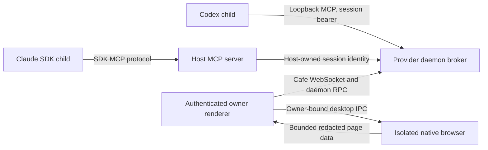

# Agent Browser provider bridge

This server slice connects current Cafe providers to the isolated Agent Browser desktop runtime. It depends on the browser contracts and policy helpers proposed in Cafe PRs #63 and #64. The coordinated native/renderer slice supplies the page, sharing controls, heartbeat, execution, and completion path. Both slices are required for a usable browser. The OCR tool contract is included here, but offline OCR execution and its packaged assets require the separate native OCR slice.

The page and provider model output are untrusted. The trusted desktop renderer mediates native actions. Cafe's authenticated backend routes requests to the provider daemon. A provider bearer identifies one live Cafe thread and configured provider instance. A replacement session gets a new bearer; delayed cleanup cannot revoke that replacement.

Thread access is on by default. The operator must first share a page origin. Routine snapshots, offline OCR, clicks, non-sensitive typing, and same-origin navigation use that sharing decision. Origin changes, session loss, tab loss, and revocation end access. The native layer still checks the current document and target. Passwords, tokens, verification codes, and CAPTCHA controls remain operator-only. These checks do not make arbitrary page text trustworthy or prevent every harmful instruction in page content.

Only an owner connection over HTTPS or a same-machine transport can grant, poll, complete, or revoke browser work. Disabled thread IDs come from backend settings, never from the renderer's poll body. A route-owned semaphore orders polls, grants, completions, and persisted disables across connections. Revocation removes queued work and old target snapshots. The disable list survives restarts; grants, credentials, page data, and action values do not enter the command ledger.

The broker has the contract's request and queue limits. HTTP bodies require Content-Length and stay below 64 KiB. The listener accepts only loopback peers, its exact numeric-loopback Host and port, POST JSON at `/mcp`, and no browser Origin. It limits simultaneous HTTP requests to 64. The default-access renderer heartbeat expires after five seconds, including pending work. Each action also has its own deadline. Native OCR can take longer than a heartbeat interval, so the renderer must keep polling during execution. The explicit single-thread grant API retains its fixed grant deadline; native tab and origin checks still apply.

Codex receives an environment-variable name in `env_http_headers`; the actual bearer stays in its copied child environment. Claude uses the SDK's public in-process MCP transport. Its HTTP MCP configuration is unsuitable for private headers because SDK 0.3.266 serializes that configuration into process arguments. The SDK transport forwards only server metadata to the child. See the [Codex app-server reference](https://developers.openai.com/codex/app-server) and [Claude SDK MCP reference](https://code.claude.com/docs/en/agent-sdk/mcp). The pinned local SDK declarations and implementation were checked; no provider version changes are part of this port.

The main threats and corresponding checks are:

| Threat                                         | Control and regression                                                                                      |
| ---------------------------------------------- | ----------------------------------------------------------------------------------------------------------- |
| One provider impersonates another thread       | Random session credential plus exact identity headers; forged identity and replacement tests                |
| An old process uses a renewed page             | Credential rotation and exact-scope release; delayed-finalizer and stale-bearer tests                       |
| Another window restores a disabled thread      | Backend settings override and shared semaphore; delayed-poll versus durable-deny test                       |
| A page or remote guest claims native execution | Owner/transport authorization and separate native sender checks; denied-caller tests                        |
| Stale page data selects a control              | Snapshot owner, origin, action type, native document identity, and request deadline checks                  |
| Disconnect leaves an action running            | Heartbeat expiration rejects pending work and completion; reconnect needs a new request                     |
| Requests exhaust memory or sockets             | Bounded HTTP bodies, concurrency, queue, targets, results, and timeouts                                     |
| Diagnostics retain page content or credentials | Fixed RPC failures; no durable mutation receipt for browser RPC; child-environment or host-only credentials |

Tests use synthetic pages, local mock providers, real MCP protocol transports, and in-memory settings. They do not log into accounts or prove compatibility with every user-installed provider version. Review should include the native slice and the built combined application before adoption.
