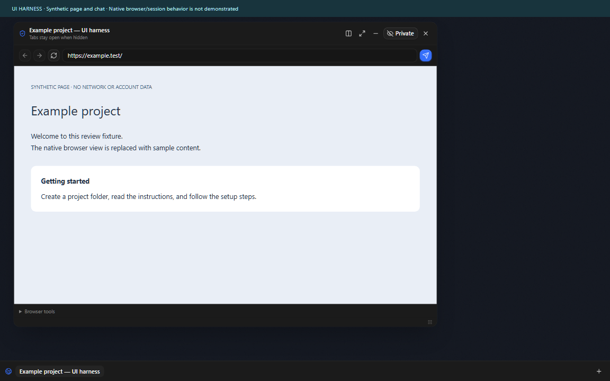
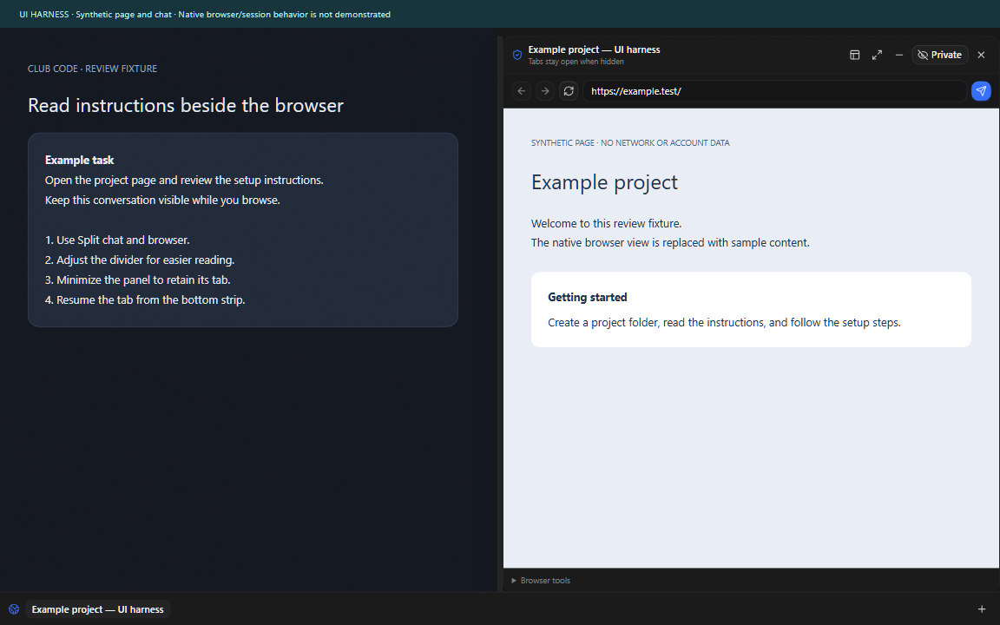

# Cafe Code feature adoption — September 2026

This guide compares the current Club Code source with Cafe Code on 2026-09-11.
It helps maintainers choose a feature without importing the complete fork.

このガイドは2026年9月11日時点のClub CodeとCafe Codeを比較します。
フォーク全体を取り込まず、必要な機能を選んで検討するための資料です。

## Comparison baseline

- Cafe Code `dev`: [`99fbaec8`](https://github.com/cafeai/cafe-code/commit/99fbaec89da429924171c89d66a8f3455e42d9b0).
- Cafe Code `main`: [`60b64a05`](https://github.com/cafeai/cafe-code/commit/60b64a059232396b3123296271af541d5fde2edc), stable 0.2.0.
- Club Code runtime baseline: `508e4b4e`, plus the browser changes published with this guide.

Current Cafe Code development includes Codex 0.154.0, Claude Agent SDK 0.3.266,
Grok ACP, authenticated Cafe MCP controls, Realtime dictation, generic attachments,
editable queues, Task Atrium, and further provider recovery changes.
It has no embedded agent browser implementation at the compared commit.

Do not overwrite current Cafe provider adapters with older Club files.
Preserve upstream provider versions, routing, credential ownership, and recovery behavior.
An open PR is a proposal; its status does not prove the feature is still absent upstream.

## Agent Browser: implemented Club behavior

Club Code provides up to eight isolated temporary tabs. Hide and Minimize retain
pages and login sessions in a bottom tab strip. Floating panels move and resize.
Split view reflows chat and browser around an adjustable divider.
The layout reserves native titlebar controls and stacks on narrow windows.
Ending one tab clears its session; restarting the application ends all tab sessions.

Codex and Claude threads can use an explicitly shared origin by default.
Each thread has a saved disable option. Routine actions on that origin reuse its
authorization. Fresh snapshot targets, identity checks, revocation, and expiry
still apply. Passwords and two-factor codes remain operator-only.
OpenCode does not have this browser bridge.

The publication also repairs provider-switch revocation affecting unrelated
threads, controls that could not revoke access during an action, and expired
poll replies. Snapshot handoff text now describes the current authorization model.
See the [security boundary](./embedded-browser-security.md) and
[current build guide](./club-code-current-build-guide.md).

日本語：最大8個の一時タブ、ログインを保持する非表示・最小化、移動・サイズ変更、
調整できるチャットとの分割表示を実装しています。共有したオリジンに対する通常操作は、
同じ承認を利用します。スレッドごとの無効化、失効、本人性と対象の確認は維持します。
パスワードと二要素認証コードの入力は利用者のみが行います。
タブを終了するとそのセッションを消去し、アプリ再起動ですべてのタブを終了します。

## Browser adoption boundaries

The first proposals are small foundations against current Cafe `dev`.
They do not activate a browser, endpoint, provider tool, or permission.
The complete working implementation is available in Club Code for reference.

- [Cafe PR #63: bounded browser contracts](https://github.com/cafeai/cafe-code/pull/63) is based directly on current `dev`.
- [Cafe PR #64: URL and redaction helpers](https://github.com/cafeai/cafe-code/pull/64) is independent of #63 and also based on current `dev`.
- [Club PR #66: complete source publication](https://github.com/John-Ryan21337/club-code/pull/66) contains the working browser and this guide.

| Unit                               | Source to review                                                                                          | Prerequisites and integration work                                                           |
| ---------------------------------- | --------------------------------------------------------------------------------------------------------- | -------------------------------------------------------------------------------------------- |
| Bounded browser contracts          | `packages/contracts/src/embeddedBrowser.ts`                                                               | Direct-to-dev schema proposal; runtime must enforce authorization.                           |
| Pure URL and redaction policy      | URL, display, redaction, and sensitive-entry helpers in `DesktopEmbeddedBrowser.ts`                       | Independent proposal; redaction is best effort, not a credential guarantee.                  |
| Native browser and manual controls | `apps/desktop/src/browser/`, `apps/desktop/src/ipc/methods/embeddedBrowser.ts`                            | Contracts; owner-bound IPC, partitions, cleanup, selected-tab visibility.                    |
| Agent request authority            | `apps/server/src/provider/AgentBrowserBridge.ts`                                                          | Contracts; authenticated loopback MCP, bounded queue, exact identities, expiry, revocation.  |
| Provider and renderer integration  | Provider adapters, `apps/server/src/ws.ts`, `EmbeddedBrowserWorkspace.tsx`, `useEmbeddedBrowserLayout.ts` | Native browser and broker; adapt to current Cafe APIs rather than replacing files wholesale. |
| Offline English/Japanese OCR       | `EmbeddedBrowserOcr.ts`, `EmbeddedBrowserOcrWorker.ts`, packaged language data                            | Optional native browser addition; capture/output bounds and child cleanup.                   |
| One-time composer context          | `apps/web/src/embeddedBrowserChatHandoff.ts` and composer integration                                     | Optional; review before sending, memory-only draft context, current live authorization.      |

Cafe already handles native caption geometry for Task Atrium. Reuse that current
layout policy when adding browser panels. Preserve macOS, Linux, fullscreen,
and ordinary Web UI behavior. Electron windows and authenticated browser sessions
need native lifecycle testing; schema tests alone cannot verify them.

日本語：最初のPRは現行Cafe `dev`向けの小さな基盤です。ブラウザーや権限は有効にしません。
完成した実装はClub Codeで参照できます。ネイティブ表示、リクエスト管理、プロバイダー連携、
OCR、チャットへの一時的な受け渡しは、依存関係を確認して個別に取り込めます。

## Existing Cafe proposals

These proposals already exist. Review their current diff and prerequisites before adoption.
This inventory does not claim they all merge cleanly against the comparison baseline.

| Feature                | Existing Cafe PRs                                                                                                                                                                                                                                                                                                                                                                                                                                                                                                            | Selection advice                                                                                                    |
| ---------------------- | ---------------------------------------------------------------------------------------------------------------------------------------------------------------------------------------------------------------------------------------------------------------------------------------------------------------------------------------------------------------------------------------------------------------------------------------------------------------------------------------------------------------------------- | ------------------------------------------------------------------------------------------------------------------- |
| Safe settings profiles | [17](https://github.com/cafeai/cafe-code/pull/17), [53](https://github.com/cafeai/cafe-code/pull/53), [55](https://github.com/cafeai/cafe-code/pull/55), [59](https://github.com/cafeai/cafe-code/pull/59), [61](https://github.com/cafeai/cafe-code/pull/61)                                                                                                                                                                                                                                                                | Start with the convergence description in 61; distinguish foundation, preview/delete, and mobile bootstrap.         |
| Mobile presentation    | [54](https://github.com/cafeai/cafe-code/pull/54)                                                                                                                                                                                                                                                                                                                                                                                                                                                                            | Device-local layout choice.                                                                                         |
| Local YouTube lists    | [49](https://github.com/cafeai/cafe-code/pull/49), [50](https://github.com/cafeai/cafe-code/pull/50), [52](https://github.com/cafeai/cafe-code/pull/52), [58](https://github.com/cafeai/cafe-code/pull/58), [60](https://github.com/cafeai/cafe-code/pull/60)                                                                                                                                                                                                                                                                | Assets, parsing/catalog, library, settings; these do not activate playback.                                         |
| Auto Nudge             | [29](https://github.com/cafeai/cafe-code/pull/29), [34](https://github.com/cafeai/cafe-code/pull/34), [47](https://github.com/cafeai/cafe-code/pull/47), [51](https://github.com/cafeai/cafe-code/pull/51), [56](https://github.com/cafeai/cafe-code/pull/56), [62](https://github.com/cafeai/cafe-code/pull/62)                                                                                                                                                                                                             | Contract, persistence, authority, UI, terminal stop, global stop; retain server authority and manual-work priority. |
| Resource telemetry     | [15](https://github.com/cafeai/cafe-code/pull/15), [37](https://github.com/cafeai/cafe-code/pull/37), [38](https://github.com/cafeai/cafe-code/pull/38), [39](https://github.com/cafeai/cafe-code/pull/39), [40](https://github.com/cafeai/cafe-code/pull/40), [42](https://github.com/cafeai/cafe-code/pull/42), [43](https://github.com/cafeai/cafe-code/pull/43), [44](https://github.com/cafeai/cafe-code/pull/44), [45](https://github.com/cafeai/cafe-code/pull/45), [46](https://github.com/cafeai/cafe-code/pull/46) | Host sampler and project probes precede service/RPC, graph rendering, and mount.                                    |
| Atmosphere             | [28](https://github.com/cafeai/cafe-code/pull/28), [30](https://github.com/cafeai/cafe-code/pull/30), [31](https://github.com/cafeai/cafe-code/pull/31), [32](https://github.com/cafeai/cafe-code/pull/32)                                                                                                                                                                                                                                                                                                                   | Falling effects, Hexagons import, Canvas bounds, usage-reactive effects.                                            |
| Attachments            | [33](https://github.com/cafeai/cafe-code/pull/33), [48](https://github.com/cafeai/cafe-code/pull/48)                                                                                                                                                                                                                                                                                                                                                                                                                         | 30 MiB images and explicit camera capture; generic file support does not cover these changes.                       |
| Provider reliability   | [35](https://github.com/cafeai/cafe-code/pull/35), [36](https://github.com/cafeai/cafe-code/pull/36), [41](https://github.com/cafeai/cafe-code/pull/41), [57](https://github.com/cafeai/cafe-code/pull/57)                                                                                                                                                                                                                                                                                                                   | Compare current stderr, auth refresh, orphan recovery, and consumed-queue behavior before restacking.               |
| Other features         | [19](https://github.com/cafeai/cafe-code/pull/19), [21](https://github.com/cafeai/cafe-code/pull/21), [22](https://github.com/cafeai/cafe-code/pull/22), [23](https://github.com/cafeai/cafe-code/pull/23), [24](https://github.com/cafeai/cafe-code/pull/24), [25](https://github.com/cafeai/cafe-code/pull/25)                                                                                                                                                                                                             | Reconnect, provider conformity, video analysis, persistent workflow, LM Studio, mobile bootstrap.                   |

Provider version proposals [26](https://github.com/cafeai/cafe-code/pull/26) and
[27](https://github.com/cafeai/cafe-code/pull/27) target older versions than current
Cafe `dev`. They are historical references, not upgrade instructions.
Clipboard reliability [20](https://github.com/cafeai/cafe-code/pull/20) is already merged.

日本語：既存PRは上の表から選択できます。すべてが現在のブランチへそのままマージできるとは
確認していません。26・27のプロバイダーバージョンは現行Cafeより古く、更新手順としては
使わないでください。クリップボード修正20はマージ済みです。

## Browser UI review media

These captures show the actual browser panel component in a synthetic test harness.
The chat and page are sample content; the native browser view is mocked.
They compare floating, split, and minimized states, not historical application versions.
They do not prove native login persistence or include any account data.

[Watch the split, resize, minimize, and resume recording](./images/agent-browser-20260911/browser-layout-ui-harness.webm).

| Floating panel                                                                                      | Chat/browser split                                                                     |
| --------------------------------------------------------------------------------------------------- | -------------------------------------------------------------------------------------- |
|  |  |

[Minimized tabs](./images/agent-browser-20260911/03-minimized-tabs.png) and
[resumed split](./images/agent-browser-20260911/04-resumed-split.png) show the retained tab strip.

日本語：これは実際のパネル部品を使ったテスト画面です。チャットとページはサンプルで、
ネイティブブラウザーは模擬しています。実アカウントの情報は含みません。
表示状態の比較であり、過去版との比較やネイティブのログイン保持の証明ではありません。

## Review evidence

Each new PR records its exact base, scope, focused tests, repository gates, and remaining integration work.
The Club browser review exercised the broker, native browser service, and Chromium workspace tests.
Publication requires formatting, lint, type checking, unit/integration tests, and a desktop build.
No application restart is required to publish source; installed binaries are a separate release step.

ChatGPT agents performed the source analysis and independent code review.
A Claude Code 2.1.259 review was attempted but could not authenticate because its OAuth session had expired.
No Claude review result is claimed.
