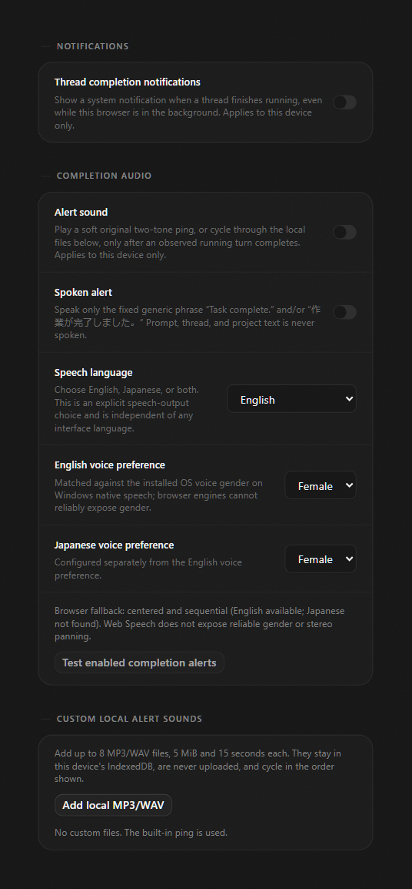
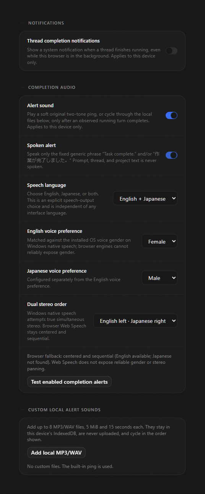

# Completion alerts

Opt-in audio for "a thread finished running": a short built-in ping (or your own
local MP3/WAV files), and/or a spoken alert that says one of exactly two fixed
phrases. Everything here is per-device client settings, defaults to off, and
never uploads audio.

This document covers what is implemented, how the pieces fit together, the
adoption order for the parts that are not implemented here, and the limits that
were actually tested rather than assumed.

## What is implemented

| Area                                    | File                                                              |
| --------------------------------------- | ----------------------------------------------------------------- |
| Speech/voice IPC contracts              | `packages/contracts/src/ipc.ts`                                   |
| Per-device client settings              | `packages/contracts/src/settings.ts`                              |
| Windows native speech (`System.Speech`) | `apps/desktop/src/speech/WindowsCompletionSpeech.ts`              |
| Desktop IPC methods                     | `apps/desktop/src/ipc/methods/completionSpeech.ts`                |
| Playback, fallback, status reporting    | `apps/web/src/completionAlerts.ts`                                |
| Transition + burst rules                | `apps/web/src/completionAlertTransitions.ts`                      |
| Local custom files (IndexedDB)          | `apps/web/src/completionAlertFiles.ts`                            |
| Installed-voice status copy             | `apps/web/src/completionSpeechSupport.ts`                         |
| Settings UI                             | `apps/web/src/components/settings/NotificationsSettingsPanel.tsx` |
| Real completion caller                  | `apps/web/src/components/DesktopNotificationWatcher.tsx`          |

### Settings (per device, all default off/safe)

`completionAlertSoundEnabled`, `completionAlertSpeechEnabled`,
`completionAlertLanguage` (`en` | `ja` | `dual`),
`completionAlertEnglishVoiceGender`, `completionAlertJapaneseVoiceGender`,
`completionAlertDualStereoOrder`.

These live in client settings (localStorage in a browser, the desktop client
store in Electron) because whether a machine should make noise depends on that
machine's speakers and who is sitting near it — not on a shared server profile.

**Local vs. server isolation.** Ordinary Cafe client settings are shared: once a
server config exists, `useSettings` reads the server copy and every client patch
is pushed over `server.updateClientSettings`. That is wrong for audio, so these
six keys are split out of that path by
`apps/web/src/completionAlertSettings.ts`:

- `splitCompletionAlertSettings(patch)` divides any client patch into a `shared`
  half and the six-key audio `local` half.
- `withLocalCompletionAlertSettings(server, local)` overlays the device's own
  audio values on top of the server client settings, so `useSettings`,
  `getClientSettings`, and every consumer read this machine's choice even when
  the server profile says otherwise. Another device enabling speech cannot make
  this one talk.
- `useUpdateSettings` sends only the `shared` half to the server RPC and writes
  the audio half through local persistence only. It waits for
  `hydrateClientSettings()` first, so a write cannot race ahead of hydration and
  be overwritten by the persisted snapshot that arrives a moment later.
- The one-time "import my local settings to the server" migration compares and
  uploads the shared half only, so a pre-existing local audio preference is
  never published to the shared profile.

Before hydration finishes, every audio key reads as its `false`/default value,
which is also why the audio observer waits for `useLocalClientSettingsHydrated()`. A shared server snapshot does not satisfy this device-only readiness gate.

### When an alert fires

`DesktopNotificationWatcher` is the only caller. It now runs two deliberately
separate observers:

1. **Native OS notifications** — unchanged: Electron only, driven by the
   session running flag, suppressed for the focused thread.
2. **Completion audio** — desktop renderer _and_ open browser tabs, driven by
   `latestTurn` moving `running` → `completed` for the _same_ turn id.

The audio observer only alerts when all of these hold:

- local client settings have hydrated (`useLocalClientSettingsHydrated`), and
- a baseline snapshot already exists, and
- at least one switch is on, and
- some observed thread's own running turn reached `completed`.

`collectCompletionTransitionKeys(previous, next)` returns an empty list whenever
`previous` is `null`. This makes initial hydration and remount silent. A thread that appears already `completed`, including after its previous row was removed during a store refill, does not alert. A transport reconnect that retains an observed running row can still produce an alert when that same turn is later reported complete; the watcher does not reset its baseline on transport state alone.

### Withdrawing consent mid-alert

An alert is not atomic: the ping runs for most of a second, and native speech is
a PowerShell round trip that can take seconds. The user can switch audio off, or
close the renderer, in that window, so consent is re-read at every stage rather
than captured once when the burst fires.

- `apps/web/src/completionAlertRun.ts` owns one run. It re-reads both switches
  between the sound and the speech and carries two abort handles: `sound` and
  `speech`. Turning one half off stops only that half.
- `DesktopNotificationWatcher` aborts the matching handle as soon as a switch
  reads `false`, and aborts both on unmount, alongside disposing the coalescer.
- Every playback path in `completionAlerts.ts` takes the signal: the decoded
  custom file, the built-in ping (its oscillators are stopped and the
  `AudioContext` closed), the native clips, and Web Speech (which calls
  `speechSynthesis.cancel()`, because an utterance already queued in the engine
  would otherwise keep talking).
- A native synthesis response that arrives _after_ cancellation is dropped
  before it is decoded, so a slow subprocess cannot speak into a torn-down
  renderer.
- Cancellation is a `CompletionAlertCancelledError`, distinct from a playback
  failure: a cancelled custom file does not fall back to the built-in ping, and
  the settings panel does not write a status line for it.
- The settings panel's own preview buttons use the same mechanism; closing
  settings stops a preview and prevents a state write into an unmounted panel.

Bursts are coalesced by `createCompletionBurstCoalescer`: a 700 ms settle window
collapses a fan-out of threads finishing together into one alert, and a 4 s
cooldown stops a second burst from stacking overlapping `AudioContext`s. It is
disposed on unmount so no pending timer can fire into a torn-down renderer.

### Speech is generic, never your content

The renderer never sends text across the IPC boundary. It sends a
language/gender pair, and the native side speaks one of two fixed phrases:

- `en` → `Task complete.`
- `ja` → `作業が完了しました。`

Thread titles, project names, prompts, and model output are never spoken. This
is a privacy choice, not just a simplicity one: audio leaves the machine's
speakers where anyone nearby can hear it. `DesktopCompletionSpeechSynthesizeInputSchema`
has no text field, so no future caller can widen it without a contract change.

### Installed-voice honesty

Native speech uses real `System.Speech` enumeration. It filters by culture
prefix (`ja-`/`en-`) **and** reported gender, then prefers familiar local voices
(Haruka, then Ayumi for Japanese female; Zira for English female) _within_ that
filter. It never turns an English voice into Japanese and never claims a gender
it did not match:

- No matching voice → `clip: null` with a specific reason. Nothing is
  substituted.
- A returned clip whose language/culture/gender disagrees with the request is
  rejected in the renderer too (`validateNativeResult`).
- Browser Web Speech is always labeled a _fallback_: centered, sequential, and
  explicitly described as unable to expose reliable gender or panning. It is
  never presented as native.
- In dual mode, one side succeeding natively while the other is missing keeps
  the native side and reports the missing side — it does not downgrade both, and
  it does not claim simultaneous stereo for the partial result.

### Bilingual ordering and stereo

Requested order follows the stereo preference: `ja-left-en-right` requests
`["ja", "en"]`, `en-left-ja-right` requests `["en", "ja"]`. When both native
clips exist and `createStereoPanner` is available, both start at the same
`AudioContext` timestamp with pan `-1`/`+1` per the preference — genuine
simultaneous stereo. With one clip, or without a stereo panner, playback is
centered and the status message says so.

### Custom local alert files

Up to 8 files, each MP3/WAV, non-empty, at most 5 MiB and 15 seconds after a
real `decodeAudioData` pass. They are stored as blobs in this device's
IndexedDB (`cafe-code-completion-alerts`), never uploaded, and cycle in the
listed order. An undecodable file falls back to the built-in ping rather than
failing the alert.

The file-count limit is checked again inside the IndexedDB write transaction.
Concurrent imports from two tabs cannot both consume the same remaining slots;
an over-limit batch is rejected without storing part of that batch.

### Resource cleanup

Every `AudioContext` is closed in a `finally`. A suspended context gets a
bounded 2-second resume attempt. If the browser still blocks it, playback fails
with a fixed message. The ping reports success only after both notes emit
`ended`, not after a wall-clock delay. Playback stages are bounded at
17 s, Web Speech utterances at 10 s (then `speechSynthesis.cancel()`), and the
PowerShell child at 12 s, with the caller settled no later than 12.5 s even if
the child ignores the kill. Temporary speech directories are removed in a
`finally`. The settings panel's capability read is guarded by a monotonic
request id so a stale reply cannot overwrite a newer one or set state after the
panel closes.

### Windows child-process boundary

`WindowsCompletionSpeech.ts` never builds a command string:

- The two scripts are fixed literals passed as UTF-16LE base64
  `-EncodedCommand`, with `-NoProfile -NonInteractive -NoLogo`.
- The only per-request values (language, gender, output path) travel as
  environment variables that the script re-validates against fixed enums, so no
  caller-controlled text is parsed by a shell or by PowerShell's expression
  parser.
- The console host is spawned by absolute
  `%SystemRoot%\System32\WindowsPowerShell\v1.0\powershell.exe`, not a PATH
  lookup, and `shell: false`.
- The child environment is an allowlist of Windows system-directory entries. The
  parent's provider credentials, provider-home overrides, Node hooks, and user
  PATH are **not** inherited, and PATH is rebuilt from `SystemRoot`.
- `SystemRoot`/`windir` is validated before it is used to build that path or the
  child environment: it must be an absolute drive path with no control
  characters and no `..` segment, otherwise the request fails before any spawn.
- The child's stdin is closed immediately, its working directory is the fixed
  `System32` path rather than the caller's, and both scripts set
  `[Console]::OutputEncoding` to UTF-8 so a non-ASCII voice name arrives as UTF-8
  instead of the active Windows code page.
- Bounds that apply to the _child_: `timeout` (12 s, `killSignal: SIGKILL`),
  `maxBuffer` (256 KiB), `windowsHide`, `shell: false`, and a `finally` that
  removes the temp directory.
- Bounds that apply to the _caller_ are deliberately separate. A Windows process
  that ignores the kill would leave `execFile`'s callback pending forever, so an
  independent 500 ms grace timer settles the caller at 12.5 s with a generic
  "did not finish" error. That helper is then quarantined: it is killed, our ends
  of its pipes are destroyed, it is unref'd, and it **keeps its admission slot**
  until Node reports it closed. At most two helpers may be admitted (one per
  language for a dual alert), so a stuck helper degrades into a "busy" rejection
  instead of accumulating replacement processes. A spawn that throws before a
  child exists releases its slot immediately.
- The WAV is read through a bounded reader (`open` plus a 1 MB + 1 byte read
  loop), not `readFile`, so an unexpectedly large file is never loaded whole; the
  extra byte is what makes the over-limit case detectable, and it is reported as
  an unsafe WAV rather than as a synthesis failure.

Returned WAV bytes are validated before crossing IPC: RIFF/WAVE header, PCM
format, non-zero channels/sample rate, ≤ 1 MB, and ≤ 15 s computed from
`avgBytesPerSec`. Voice metadata strings are length-bounded and the voice list
is deduplicated and capped at 128.

## Adoption order

This slice requires [Cafe PR #75](https://github.com/cafeai/cafe-code/pull/75),
`cadc2e7f`, which binds desktop IPC calls to the configured owner renderer and
main frame. The published prerequisite branch is
`adoption/browser-ipc-authority-20260911`. The speech methods use that shared
authority check. If the remaining items are adopted, this order avoids rework:

1. **This slice** — contracts, native speech, playback, settings UI, watcher
   wiring, after the IPC-authority prerequisite above.
2. **Meeting-privacy integration (not covered here).** This slice makes **no**
   meeting-privacy claim. The root privacy PR masks new Electron notifications;
   the audio path is deliberately title-free (generic phrases only, and a ping
   carries no content), but _whether an alert fires at all_ is not currently
   filtered by a privacy hidden-project list. Treat "audio suppressed for
   hidden projects" as a documented prerequisite to integrate after the privacy
   PR lands, by filtering the thread list the audio observer reads. Until then,
   do not advertise audio as privacy-scoped.
3. **Settings profiles**, if adopted. Classify the two enable switches as
   activation-style fields (a loaded profile must not silently start making
   noise on someone else's machine) and the four preference fields as ordinary
   included fields.
4. **UI localization.** Intentionally _not_ a dependency. The speech language is
   an explicit independent contract (`CompletionSpeechLanguageSchema`) because
   which voices are installed on a machine is an audio-device fact, not an
   interface-language preference. A localization feature can later map interface
   language onto this enum without touching the native boundary — no
   localization dependency was added for the sake of the UI language.

Not in scope and not changed: the server notification path, Web Push, the
transport, and the provider layers.

## Tested limits (what was actually verified)

Focused suites, all passing:

| Command                                                                                                                                                                                                        | Result                                |
| -------------------------------------------------------------------------------------------------------------------------------------------------------------------------------------------------------------- | ------------------------------------- |
| `yarn workspace @cafecode/contracts test src/ipc.test.ts src/settings.test.ts`                                                                                                                                 | 49 passed                             |
| `yarn workspace @cafecode/desktop test src/speech`                                                                                                                                                             | 18 passed                             |
| `yarn workspace @cafecode/web test src/completionAlertRun.test.ts src/completionAlerts.test.ts src/completionAlertTransitions.test.ts src/completionAlertFiles.test.ts src/completionSpeechSupport.test.ts`    | 31 passed                             |
| `yarn workspace @cafecode/web test:browser src/components/CompletionAlertWatcher.browser.tsx src/components/CompletionAlertLocalSettings.browser.tsx src/components/settings/CompletionAlertFiles.browser.tsx` | 6 passed (real Chromium)              |
| `yarn workspace @cafecode/web test:browser src/components/settings/SettingsPanels.browser.tsx`                                                                                                                 | 26 passed (real panel, real controls) |

After independent repair review, all four focused browser files together passed
32 tests in Chromium. The full browser suite passed 313 tests across 33 files.
The five focused web unit files passed 31 tests. Contract and desktop results
remain 49 and 18 respectively.

Review reproduced and repaired three failures: concurrent local imports could
exceed eight files; a shared server snapshot could satisfy the audio readiness
gate before device preferences loaded; and a suspended audio context could
report a played ping. Regression tests fail on the original implementation.
A second reviewer checked the repairs and reran the affected audio and browser
tests. Formatting, lint, and all ten typecheck tasks passed on the repaired source.

Plus `yarn fmt`, `yarn lint` (exit 0, zero errors; the only warning in the new
files is the deliberate control-character range in the `SystemRoot` validator),
and `tsc --noEmit` in every workspace that has a typecheck script
(contracts, desktop, web, server, shared, client-runtime, effect-acp,
effect-codex-app-server, scripts, oxlint plugin) — all clean.

Verified by test:

- Both enable switches default to `false`; every enum rejects out-of-range
  values; every field is an optional client-settings patch key.
- The synthesize input rejects an extra `text` property, so spoken content
  cannot be smuggled through the boundary.
- Capability metadata is bounded: a 513-character reason and a 129-voice list
  are rejected; a 1,500,001-character `wavBase64` is rejected.
- Native off-Windows never launches PowerShell.
- Voice listing keeps only valid `en`/`ja` gendered voices, deduplicates, and
  caps at 128.
- A missing voice returns `clip: null` with a reason — no substitution.
- Malformed, oversized (1 MB + 1), over-long (15.01 s), and culture-mismatched
  native results are all rejected, and the temp directory is still cleaned.
- The PowerShell runner: a spawner that throws synchronously releases its
  admission slot, so repeated failures keep reporting the real cause instead of
  "busy"; a throw after the child exists kills it, destroys our ends of its
  pipes, unref's it, and holds the slot until Node reaps it; two unreaped helpers
  refuse a third; every caller still settles on the 12.5 s grace timer; a late
  reap admits a replacement; and a relative or `..`-traversing `SystemRoot` is
  rejected before any spawn.
- Result boundaries through the real filesystem (no PowerShell): a written WAV is
  read back and its per-request temporary directory is gone afterwards, and a
  file one byte over the 1 MB limit is reported as an unsafe WAV — not as a
  synthesis failure — with the directory still removed.
- Non-ASCII voice metadata survives the boundary byte-exact, is deduplicated, and
  is bounded by code-unit length (512 accepted, 513 rejected); both scripts pin
  UTF-8 console output encoding.
- The scripts contain no interpolation, read request values from `$env:`, and
  re-validate the enums; the console host is an absolute System32 path; the
  child environment drops a planted credential variable and rebuilds PATH from
  `SystemRoot` rather than inheriting a hijacked one.
- A dual request keeps a valid native English clip and reports the Japanese
  reason, saying explicitly that the missing language was not substituted.
- A rejected IPC call reports a generic reason instead of the underlying error
  text.
- A clip whose gender disagrees with the request is refused rather than
  presented as an exact match.
- Web Speech language matching uses full tags: a `javanese` voice does not
  satisfy a `ja` request.
- Transitions: same-turn `running`→`completed` only; `interrupted` and a new
  turn id do not alert; a `null` baseline alerts for nothing (hydration,
  remount); an already-completed turn is not re-reported on a later
  refill; a vanished thread is ignored.
- Burst coalescing settles once per window and honors the cooldown; a burst
  arriving while an alert is still playing is dropped rather than stacking a
  second `AudioContext`, the cooldown is measured from when playback finishes,
  and a rejected burst leaves the coalescer usable.
- Cancellation, in the module and through the real watcher component in
  Chromium: switching the spoken alert off during the ping suppresses the speech
  that would have followed; unmounting the renderer aborts the ping that is
  already playing and suppresses the speech stage; a native speech response that
  lands after cancellation is never decoded or played; the built-in ping stops
  its oscillators and closes its `AudioContext` on abort; an already-aborted
  signal never starts playback; switching only the sound off still lets the
  speech play; a failed sound does not swallow the speech.
- Per-device isolation, in Chromium against the real hooks: a server profile
  with `completionAlertSpeechEnabled: true` does not enable audio on this
  client; the first-hydration migration uploads an unrelated local preference
  without any audio key; an explicit audio change is written to local
  persistence only, never to `server.updateClientSettings`.
- File validation: MP3/WAV only, non-empty, ≤ 5 MiB, decodable, ≤ 15 s.
- IndexedDB round-trip in real Chromium: add two files, cycle them in order,
  wrap around, remove one.
- Driving the real settings panel in Chromium: both switches start off and the
  test button starts disabled; the dual stereo-order control is absent until
  `dual` is chosen; toggling sound and speech, choosing `dual`, choosing
  `en-left-ja-right`, and choosing a Japanese male voice each persist the exact
  client-settings patch and are reflected in the controls; the stereo-order
  option labels render a real `·` separator instead of a literal source escape;
  the browser-served status describes Web Speech as a fallback.

All tests use mocked audio, a mocked native bridge, and temporary files. No test
emits real sound or speech, and none raises an OS notification.

Verified against real hardware on this Windows 10 machine, read-only:

- Real `System.Speech` enumeration through the hardened child environment
  succeeded: `available: true`, voices `Microsoft David Desktop` (en-US, male)
  and `Microsoft Zira Desktop` (en-US, female). The child received only the 18
  allowlisted variables plus the request value, and the host resolved to
  `C:\Windows\System32\WindowsPowerShell\v1.0\powershell.exe`.
- No Japanese voice is installed here, so a real `ja`/`female` request returned
  `clip: null` with "No installed Japanese female System.Speech voice is
  available." — the honest path, with no audio and no WAV written, because
  `System.Speech` exits before an output target is opened.

## 日本語の操作ガイド

設定の通知画面で、完了音と音声通知を個別に有効にできます。初期状態は両方とも無効です。
設定はこの端末だけに保存され、共有サーバーや別の端末には送られません。端末の設定を読み込む前には通知しません。

音声は英語の「Task complete.」、日本語の「作業が完了しました。」、または両方を選べます。
スレッド名、プロジェクト名、入力、モデルの回答は読み上げません。Windows では指定した言語と性別に一致するインストール済みの音声だけを使います。
一致する音声がなければ、その理由を表示します。ブラウザーの代替音声は中央から順番に再生し、性別や左右の定位を保証しません。
両言語のネイティブ音声とステレオ機能が利用できる場合だけ、選択した左右の順序で同時に再生します。

MP3/WAV を最大8個、この端末の IndexedDB に保存できます。各ファイルは5 MiB以下、デコード後15秒以下です。
音声ファイルはアップロードしません。複数のタブから同時に追加しても8個の上限を超えません。上限を超える一括追加は全部を拒否し、一部だけ保存しません。

通知するのは、監視中の同じターンが実行中から完了に変わったときです。初回読み込み、再マウント、完了済みの行の追加では鳴りません。
再接続の間も実行中の行を保持していた場合は、そのターンの完了を後から受け取ると通知できます。短時間の完了はまとめて通知します。
完了音や音声を無効にすると、その種類の再生を中止します。画面を閉じると両方を中止し、遅れて届いた音声結果を再生しません。

ブラウザーが音声を停止状態にした場合は、最大2秒間だけ再開を試みます。再開できなければ失敗を表示し、「再生済み」とは表示しません。
設定のテストでこの端末の状態を確認できます。会議プライバシーで非表示にしたプロジェクトの通知抑制は、この変更には含まれません。

検証用の画面と自動テストには合成データを使っています。録画に音声はありません。実際のスピーカー出力、左右の聞こえ方、日本語ネイティブ音声は実機検証していません。

## Media

The captures under `docs/images/completion-alerts/` are **synthetic-harness
recordings of the real `NotificationsSettingsPanel`**: synthetic settings
storage, no server, no real thread, project, or account data, and a
browser-served renderer with no desktop bridge. They were produced by a
temporary vitest browser-mode spec plus a temporary copy of
`vitest.browser.config.ts` with Playwright `recordVideo` enabled. Both fixtures
were deleted after the capture and the shared browser config was not modified.

**No sound exists in these captures.** The WebM has no audio track, no
`AudioContext` was opened, and a browser-served renderer has no native speech
IPC. What is visible is the settings surface reacting to clicks, not audio.

| Before (everything off)                                                                      | After (sound + speech, dual, Japanese male)                                                 |
| -------------------------------------------------------------------------------------------- | ------------------------------------------------------------------------------------------- |
|  |  |

[`completion-alerts-settings-interaction.webm`](images/completion-alerts/completion-alerts-settings-interaction.webm)
records the interaction between those two frames in one Chromium context:
enabling the alert sound, enabling the spoken alert, switching the language to
`dual` (which reveals the stereo-order control), choosing `en-left-ja-right`,
choosing a Japanese male voice, and then switching both alerts back off, which
disables the test button again. That last step is the _settings_ half of
withdrawing consent. Cancelling playback that is already running has no visible
surface, so it is covered by `src/components/CompletionAlertWatcher.browser.tsx`
instead of by video.

Not verified on real hardware, and not claimed:

- Native Japanese synthesis and true simultaneous native stereo. No Japanese
  voice is installed on the machine used, so that path has unit coverage only.
  The UI reports the real installed-voice status instead of implying it works.
- Actual speaker output, device routing, and perceived left/right placement.
- Browser Web Speech voice availability on other browsers and platforms.
- Audible cancellation. The abort paths are verified by test through synthetic
  `AudioContext`/bridge mocks; no test emitted real sound, so "the speaker
  actually went quiet" is asserted at the API level (sources stopped, context
  closed, `speechSynthesis.cancel()` called), not by listening.
- Multi-device behavior against a live shared server. Per-device isolation is
  verified against the real `useSettings`/`useUpdateSettings` hooks with a
  synthetic server config and persistence, not against a running backend with
  two real clients.
