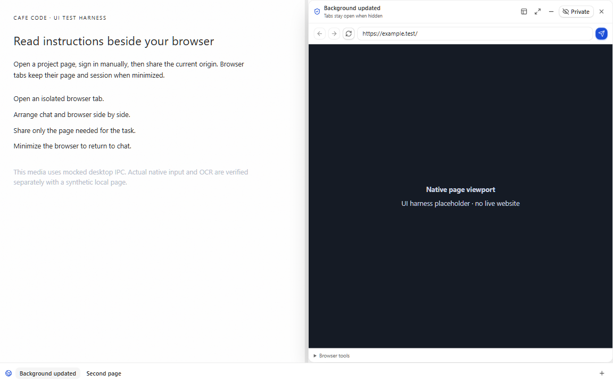

# Agent Browser workspace

This slice connects the isolated native browser and provider broker to Cafe's renderer. It requires the browser contracts and policy helpers, the sender-bound IPC prerequisite, the native runtime, and the broker integration. The local OCR engine is a separate optional stack entry.

Select **Open isolated browser** to open a tab. Use the browser address field to open a site and sign in manually. Select **Share current origin** when an agent needs the page. The native confirmation applies to that origin; routine actions reuse the grant. Sensitive entry still has a separate confirmation. Closing a tab ends its isolated session and clears its storage.

The floating panel can move and resize. Split mode leaves chat and instructions beside the browser, or above it on a narrow window. The divider also accepts arrow keys and Home. The chat pane uses its available width to select the existing navigation drawer and plan sheet. Its composer stays above the retained tab bar. Minimize and Hide keep tabs in the bottom bar without closing their pages. Windows caption buttons retain their native clearance. These controls preserve sessions within the running app; they do not restore tabs after an app restart.

Thread access is enabled by default. **Disable for this thread** immediately stops new local execution and saves the exclusion before the UI reports success. A rejected write remains visible. The server also enforces the saved exclusion. Polling continues while a native action is pending so long actions retain the renderer lease. A failed native action remains a failure even when the broker accepts its completion message.

**Add to one-time chat context** adds a bounded, redacted snapshot. The composer shows a separate editable area. The context stays in memory before Send or Queue and is excluded from the saved draft. It can become part of normal chat history or the durable queue after submission. Direct send failures restore the draft and context separately. Queue entries retain a bounded context offset so editing or retrying them can recover page text outside the saved draft. Queue debug previews omit the browser suffix. Switching threads clears the in-memory context.

DOM and OCR redaction is heuristic. A shared page can contain confidential text that does not match a known secret pattern. Share only the page required for the task and review context before sending it. A copied snapshot grants no control authority; live actions still need native origin and target checks.

Canonical retries without a saved context offset use the reserved snapshot marker to recover browser text conservatively. Manually written text with the same marker can also move into the separate context field. This does not delete it or grant control authority.

## Review media

These images and the video show the actual renderer component with mocked desktop IPC. The page area is explicitly a placeholder. They are UI evidence, not proof of a logged-in page or native remote-page execution. Native input, OCR, isolation, and cleanup use separate real Electron probes with synthetic local pages.

[Floating panel](images/embedded-browser/floating-ui-harness.png) · [Minimized tabs](images/embedded-browser/minimized-ui-harness.png) · [Interaction video](images/embedded-browser/workspace-ui-harness.webm)

The browser fixture covers titlebar geometry, tab retention, split resizing, sharing, durable denial, expired requests, delayed action heartbeats, duplicate completion, and native failure feedback. Composer checks cover context-only and ordinary-draft handoffs, rejected sends, and exact retry content. Queue tests verify the persisted offset and reject offsets beyond the queued text.
