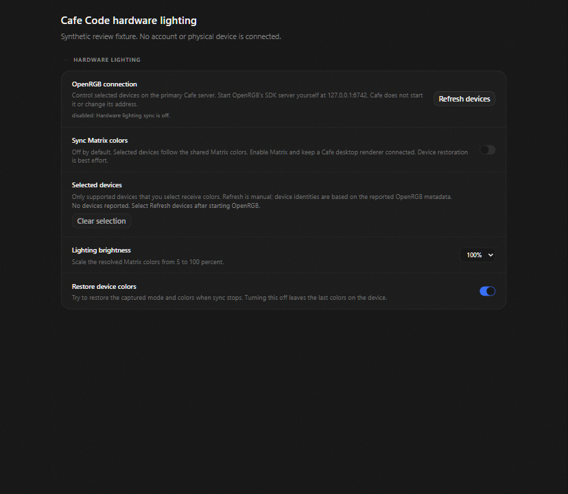
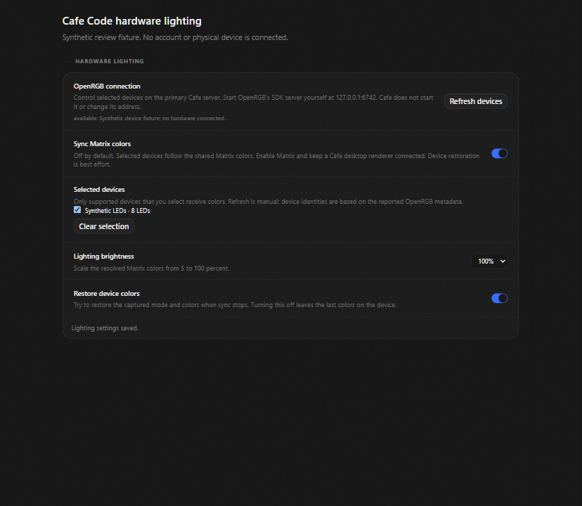

# Matrix hardware lighting / Matrix のハードウェア照明

This adoption connects the Matrix palette to explicitly selected OpenRGB devices. It is off by
default. The prerequisite is [Matrix runtime PR #100](https://github.com/John-Ryan21337/club-code/pull/100)
at `1fb29f2b`, on current Cafe dev `99fbaec8`. The proposal is tracked in
[Cafe issue #92](https://github.com/cafeai/cafe-code/issues/92).

この提案は、Matrix の色を、明示的に選択した OpenRGB デバイスに反映します。初期状態は無効です。
前提は Matrix ランタイム PR #100 の `1fb29f2b` です。Cafe の `dev` `99fbaec8` に基づきます。
提案の記録は Cafe issue #92 にあります。

## Use / 使い方

1. Start OpenRGB's SDK server yourself on the primary Cafe server machine, at `127.0.0.1:6742`.
   Cafe does not start OpenRGB, scan the network or accept a different endpoint.
2. Open **Settings → Window atmosphere → Hardware lighting**. Select **Refresh devices**.
3. Select supported devices, then enable **Sync Matrix colors**. Enable Matrix in the atmosphere
   controls and keep the Cafe desktop renderer connected. Ordinary browser renderers do not publish.
4. Set brightness from 5 to 100 percent. **Restore device colors** is enabled by default.
5. Disable sync or clear the selection to stop. Restoration tries to return the captured device
   colors and mode. If restoration is disabled, the device keeps the last colors.

6. プライマリ Cafe サーバーのコンピューターで、OpenRGB の SDK サーバーを `127.0.0.1:6742` に
   自分で起動します。Cafe は OpenRGB を起動せず、ネットワークを走査せず、別の接続先も受け付けません。
7. **Settings → Window atmosphere → Hardware lighting** を開き、**Refresh devices** を選択します。
8. 対応デバイスを選び、**Sync Matrix colors** を有効にします。背景設定で Matrix を有効にし、
   Cafe デスクトップの接続を維持します。通常のブラウザー画面は色を送信しません。
9. 明るさは 5～100% に設定できます。**Restore device colors** は初期状態で有効です。
10. 同期を無効にするか、選択を解除すると停止します。復元は、保存した色とモードに戻す試行です。
    復元を無効にすると、デバイスには最後の色が残ります。

## Behavior and limits / 動作と制限

- The renderer publishes the resolved palette after a Matrix frame is committed. Uniform colors
  remain exact; per-stream colors use 32 deterministic palette samples. This is palette sampling,
  not pixel capture or a mapping from individual glyphs to physical LEDs.
- One frame RPC can be in flight, with one latest pending frame. Normal palette updates are
  coalesced over 50 ms; a one-second heartbeat keeps a frozen palette active. The backend enforces
  a minimum 50 ms interval between device frame writes.
- The backend owns one operation and no request queue. Its five-second deadline retires owned
  sockets. A timed-out operation keeps the admission slot until its actual promise settles. One
  pending stop is allowed. Shutdown is bounded and cancels lease timers.
- Connect, packet response and write operations have 1.5-second deadlines that partial traffic
  cannot extend. Parsing is bounded to 2 MiB per packet, 64 controllers and 4,096 LEDs per device.
  RPC frames contain at most 64 RGB byte colors. Strings, counts, packet sizes and duplicate device
  identities are checked before use.
- A three-second frame lease requests a stop when the publisher disappears. Restoration is best
  effort: a disconnected or changed device, an unavailable OpenRGB server, firmware changes or a
  changed mode layout can prevent it. This is not a guarantee that physical lights turn off.
- Discovery is manual. IDs derive from reported device metadata, not a permanent hardware identity.
  Ambiguous duplicate IDs are refused. Reconnection locates a selected device by that ID before
  restoring colors and mode, even when OpenRGB has changed its device index.
- The adapter requests SDK protocol 5 and parses only that negotiated layout. A server that reports
  a newer maximum can negotiate version 5; a server below version 5 is refused.
- Settings acknowledgments require the selected connection to remain current. A failed or delayed
  response does not prove a write failed on the server; inspect status before retrying.

- Matrix フレームの描画後に、確定した色を送信します。単色はその値を使い、列ごとの色は決定的な
  32 色のサンプルを使います。画面のピクセル取得や、文字と LED の一対一対応ではありません。
- 同時に送信するフレーム RPC は一つで、待機中は最新の一つだけを保持します。通常の更新は 50 ms
  単位でまとめ、静止した色には 1 秒ごとの確認を送ります。デバイスへの書き込み間隔は最低 50 ms です。
- バックエンドは一つの処理だけを所有し、要求をキューに積みません。5 秒の期限でソケットを終了します。
  時間切れでも、元の処理が実際に終了するまで枠を保持します。停止要求は一つだけ保留できます。
- 接続、応答、書き込みには各 1.5 秒の期限があります。途中の通信で期限は延長されません。
  パケットは最大 2 MiB、デバイスは 64 台、各デバイスは 4,096 LED、RPC は最大 64 色です。
  文字列、個数、サイズ、重複 ID を検証します。
- 3 秒間フレームが届かないと停止を要求します。復元は可能な範囲で行います。切断、OpenRGB の停止、
  ファームウェアやモード構成の変更で復元できない場合があります。消灯を保証する機能ではありません。
- 検出は手動です。ID は報告された情報から作り、恒久的な物理 ID ではありません。重複は拒否します。
  再接続後は ID でデバイスを探すため、OpenRGB のインデックスが変わっても元の選択を追跡します。
- SDK プロトコル 5 を要求し、その構造だけを解析します。より新しいサーバーも 5 に合意できれば対応します。
  5 未満のサーバーは拒否します。
- 設定の完了表示は、選択した接続が変わっていない場合だけ更新します。応答の失敗や遅延だけでは、
  サーバーへの保存が失敗したとは断定できません。再試行の前に状態を確認してください。

## Authority and threat model / 権限と脅威モデル

Device status, refresh and frame RPCs require an authenticated owner and Cafe's existing observed
loopback transport boundary. Cafe's HTTPS sibling forwards through that boundary. Client-supplied
forwarded headers and user-agent strings confer no authority. This is not native-client attestation:
an authorized owner can call the RPC directly. The desktop check only selects the normal publisher.

Hardware-specific settings use the same owner/transport requirement, before persistence. Existing
shared atmosphere settings retain their current permissions. After the owner opts in, changes to
those shared Matrix colors can change the selected lights. This proposal adds no OpenRGB endpoint
input, shell command, provider launch, raw packet API or device firmware operation.

OpenRGB is a local service outside Cafe's authentication boundary. Treat its metadata and packets
as untrusted. Device and transport failures use fixed status text; raw errors, serial numbers and
locations are not sent to the renderer or logs. Controller names and vendors are bounded display
metadata. The opaque identifier is not proof that a device is authentic.

状態取得、検出、色の送信には、認証済み所有者と、Cafe が実際に確認したループバック接続が必要です。
Cafe の HTTPS 接続もこの経路に転送されます。利用者が付けた転送ヘッダーや User-Agent は権限を与えません。
ネイティブ画面の証明ではなく、権限を持つ所有者は RPC を直接呼び出せます。

照明専用設定は保存前に同じ権限を確認します。既存の共有背景設定の権限は変えません。所有者が同期を
有効にした後は、共有 Matrix 色の変更が照明にも反映されます。任意の接続先、シェル、プロバイダー起動、
生パケット API、ファームウェア操作は追加しません。

OpenRGB は Cafe の認証範囲外にあるローカルサービスです。受信情報を信頼せず検証します。
失敗には固定の文言を使い、生のエラー、シリアル番号、接続位置を画面やログへ出しません。
名前とベンダーは長さを制限した表示情報です。ID はデバイスの真正性を証明しません。

## Verification / 検証

The independent backend and renderer reviews passed. Coverage includes a synthetic TCP regression
for restoration after device-index changes and a failing-before regression for a stale settings
click before React displays a replacement connection. Focused backend 22/22, contracts 2/2,
authenticated RPC 1/1 and renderer units 4/4 passed. Final formatting, lint, type checking (10 tasks),
the full repository graph (10 tasks; server 2,027 passed and the existing POSIX bootstrap FIFO skip),
all 338 Chromium tests and `yarn build:desktop --force` (3 tasks) passed. Generated server, desktop
and renderer bundles were checked. No physical device, live account or user application session
was used. The initial cold browser run was invalidated by Vite dependency optimization; the unchanged
source passed the complete rerun.

バックエンドと画面の独立レビューは合格しました。インデックス変更後の復元を模擬 TCP で検証し、
接続変更直後の古い設定操作も、修正前に失敗するテストで確認しました。限定テスト、整形、lint、
型検査、全リポジトリのテスト、Chromium 338 件、強制デスクトップビルドは合格です。
生成されたバンドルも確認しました。初回のブラウザーテストは Vite の依存関係更新で無効になり、
変更していないソースの全件再実行が合格しました。物理デバイス、実アカウント、利用中のアプリセッションは使っていません。

Protocol reference: [official OpenRGB SDK documentation](https://github.com/CalcProgrammer1/OpenRGB/blob/master/Documentation/OpenRGBSDK.md).

### Synthetic review media / 模擬データによる確認資料

[Interaction recording, 6.32 seconds / 操作録画、6.32 秒](pr-assets/hardware-lighting/interaction.webm)
