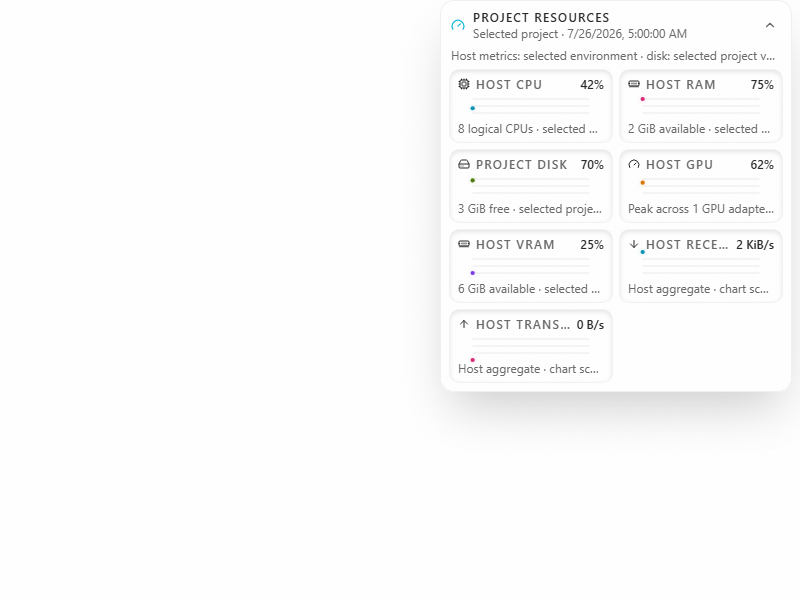

# Host network throughput

Expand **Resources** in a project chat to see host receive and transmit rates. Each card shows bytes per second and recent history. The graph scales to its recent peak; it does not show link capacity or a percentage of Internet bandwidth.

This incremental draft depends on the GPU telemetry slice and its current-dev prerequisites. It ports Club Code's host counter reader and cache, connects them to Cafe's existing authenticated telemetry RPC, and adds receive/transmit history to the resource graph. It does not measure traffic for an individual project or provider.

| Before                                                                  | After                                                                          |
| ----------------------------------------------------------------------- | ------------------------------------------------------------------------------ |
|  |  |

The images use synthetic responses. [Short interaction video](pr-assets/host-network-telemetry/interaction.webm) shows the synthetic graph being expanded and collapsed.

## Measurements and missing data

The backend shares a 15-second cache across project requests. The first valid counter read establishes a baseline and shows **Waiting**. A later valid read produces integer byte rates from the elapsed monotonic time. Counter resets establish a new baseline. Missing or invalid readings show **Unavailable**, while a measured zero shows **0 B/s**. Failed RPC polls clear the current rate and leave a gap in history.

Linux reads aggregate counters from the fixed `/proc/net/dev` path. This includes loopback and virtual interfaces. Windows uses the fixed system NetAdapter module and its default adapter selection, which excludes hidden adapters. Summing interfaces can count the same traffic at more than one interface. macOS reports this adapter unavailable. No physical adapter or operating-system combination was qualified by the synthetic tests.

The parser accepts at most 64 KiB of Linux counter text and 256 bytes of helper output. Rates and counters must be nonnegative safe integers. Interface names, addresses, destinations, ports, and packet contents do not cross the RPC or enter graph history.

The baseline tracks aggregate counters, not the set of contributing interfaces. Adding or removing an interface can therefore distort a sample; a decreasing total resets the baseline, but an increasing total cannot distinguish new traffic from a newly included interface's older counters.

## Process and failure boundaries

The renderer cannot choose a command, executable, module, interface filter, or file path. The Windows helper uses the fixed system PowerShell path, a minimal environment, closed stdin, and bounded output. Raw stderr and exceptions are discarded. Each read has a two-second deadline and a 500 ms caller-settlement grace. Only one helper is active; at most two unreaped helpers can occupy recovery slots. Service shutdown stops owned children and prevents new reads. The exact Windows rules are in `AGENTS.md`.

A Linux read uses the backend filesystem API. Caller settlement is bounded, but a blocked kernel read cannot be forcibly cancelled. Its single admission slot stays occupied until that operation ends, so repeated project requests cannot accumulate reads. The kernel-provided file is read before the parser applies its size bound. Process isolation and a streaming kernel-file reader are outside this draft.

CPU, memory, GPU, and project-volume samples remain available if this network adapter fails. Older remote servers can omit the optional network field.

The source assumptions follow [Linux network statistics](https://www.kernel.org/doc/html/latest/networking/statistics.html) and [Get-NetAdapterStatistics](https://learn.microsoft.com/en-us/powershell/module/netadapter/get-netadapterstatistics?view=windowsserver2025-ps). Default checks use fake children, synthetic counter files, fake timers, authenticated local test RPCs, and synthetic browser responses. They do not inspect the current machine's interfaces or contact a user account. Track adoption in [Cafe issue #82](https://github.com/cafeai/cafe-code/issues/82).
