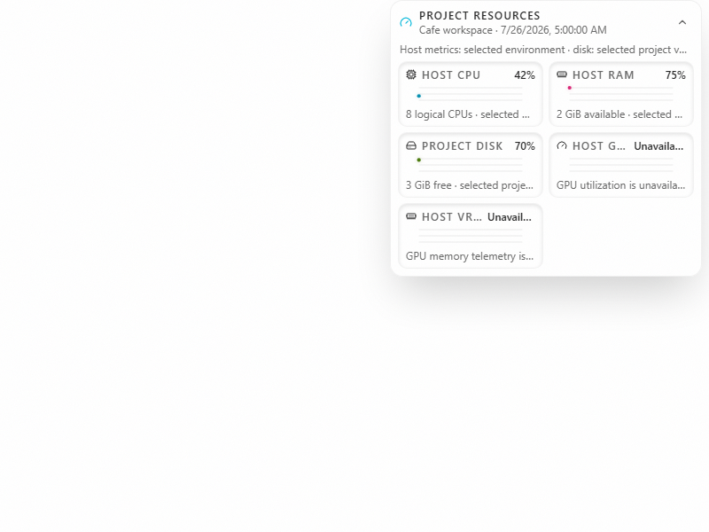
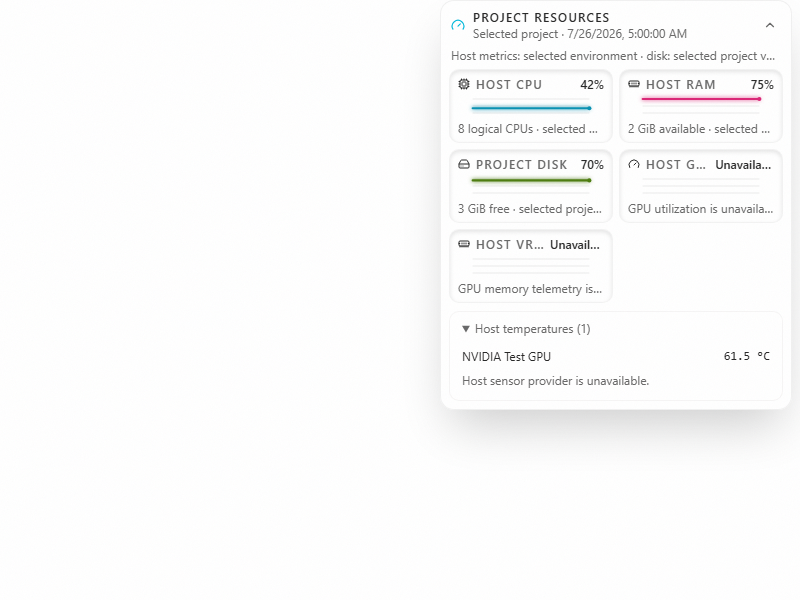

# Host temperature readings

Expand **Resources**, then **Host temperatures** in a project chat. The list shows the reported sensor label and Celsius value from the selected environment. It can retain a GPU temperature when the separate host-sensor provider is unavailable. Missing sensors are not shown as zero, and an older remote backend can omit the temperature field.

This incremental draft depends on the GPU telemetry slice and its current-dev prerequisites. It ports Club Code's temperature parser, host cache, and provider reads into Cafe's production project telemetry service. This initial UI displays the reported sensors; per-category temperature history graphs and telemetry layout customization are separate adoption work.

These images use synthetic responses. The before image shows the existing resource graph; the after image shows the new expanded sensor list and a missing-provider notice.

| Before                                                                      | After                                                                        |
| --------------------------------------------------------------------------- | ---------------------------------------------------------------------------- |
|  |  |

[Short interaction video](pr-assets/host-temperature-telemetry/interaction.webm) shows opening, closing, and reopening the same synthetic sensor list.

## Sources and limits

- NVIDIA temperatures come from the GPU prerequisite when its optional temperature field is valid.
- Linux reads fixed files below `/sys/class/hwmon`. This port accepts `coretemp`, `k10temp`, `amdgpu`, and `nvme`, whose drivers report millidegree-Celsius inputs. Unknown driver units are excluded. Disabled or faulty channels and invalid values are excluded. Driver labels remain visible; a control temperature such as AMD `Tctl` is not the same as a physical die temperature.
- The local Libre Hardware Monitor or Open Hardware Monitor provider can supply additional sensors. The implementation does not install or start a provider. The Windows path and module rules are documented in `AGENTS.md`.
- macOS host-sensor reads are unsupported. No physical sensor, driver, monitor application, or operating-system combination was qualified by the synthetic tests.

The host cache coalesces requests across projects for five seconds. A probe has a two-second deadline plus a 500 ms caller-settlement grace. A timed-out read retains its one admission slot until the underlying operation ends, so repeated project requests cannot accumulate helpers or sensor reads. Closing the service settles callers and prevents new reads.

Linux filesystem operations remain in the backend process. A kernel read that cannot complete cannot be forcibly cancelled by this code and can retain an underlying operating-system I/O operation after caller settlement. The implementation stops subsequent sensor reads after settlement and retains only that one operation. Process isolation for an uninterruptible kernel driver is outside this draft.

## Trust boundaries

The existing authenticated telemetry RPC still resolves the project from the server projection. Renderer input cannot select an executable, WMI namespace, sensor path, or command argument. Helper output has a 16 KiB bound; returned sensors have bounded counts, labels, sources, and numeric values. Exception details and stderr do not cross the RPC. Project CPU, memory, and storage fields remain independent of a missing sensor provider.

The Linux conversion follows the [hwmon interface rules](https://docs.kernel.org/hwmon/sysfs-interface.html), including the warning that some generic temperature channels carry voltages. Unit references: [coretemp](https://docs.kernel.org/hwmon/coretemp.html), [k10temp](https://docs.kernel.org/hwmon/k10temp.html), [amdgpu](https://docs.kernel.org/gpu/amdgpu/thermal.html), and the [NVMe driver conversion](https://github.com/torvalds/linux/blob/master/drivers/nvme/host/hwmon.c). Local provider discovery uses [CIM instances](https://learn.microsoft.com/en-us/powershell/module/cimcmdlets/get-ciminstance).

Track follow-up adapters in [Cafe issue #82](https://github.com/cafeai/cafe-code/issues/82). The tests use synthetic sysfs files, fixed fake child results, fake timers, and synthetic browser responses. They do not probe the current machine or contact a user account.
