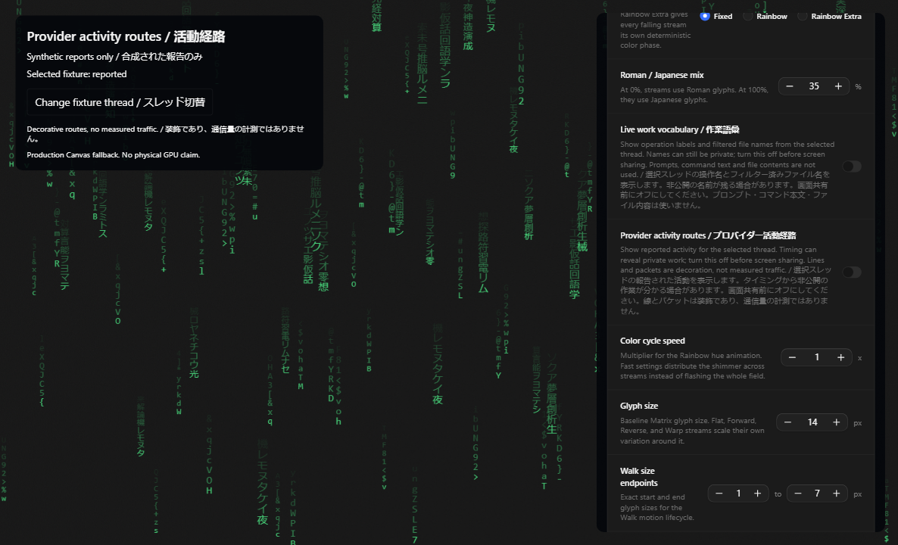
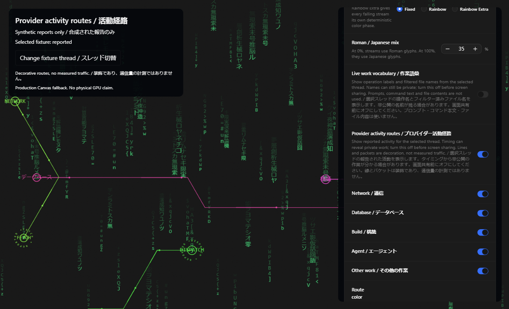

# Matrix activity routes / Matrix 活動経路

This incremental draft connects Club Code's implemented activity overlay to current Cafe's Matrix runtime. Its prerequisite is [provider observations PR110](https://github.com/John-Ryan21337/club-code/pull/110), exact `d6e1d0f76ff52149013705205f6fd3c290b6278e`, which includes vocabulary PR105 and Matrix PR100. [Cafe issue 102](https://github.com/cafeai/cafe-code/issues/102) tracks both slices. Historical proposals remain separate; none is claimed to be merged.

Club Code の実装済み活動表示を現行 Cafe の Matrix 描画へ接続する差分です。前提は上記の観測分類ドラフトであり、作業語彙と Matrix 描画も含みます。Cafe issue 102 で両方の差分を追跡します。過去の提案が統合済みであるとは扱いません。

## Use / 操作

Enable Matrix in Window atmosphere, then enable **Provider activity routes / プロバイダー活動経路**. The default is off. Choose network, database, build, agent, or other work categories. Choose a stable color for each route or the current Matrix palette. Route retention is 8–120 seconds, with a 30-second default. Standalone activity pulses last eight seconds. Disabling the master control hides every route while keeping category preferences.

Window atmosphere で Matrix を有効にしてから、**Provider activity routes / プロバイダー活動経路** をオンにします。初期設定はオフです。通信・データベース・構築・エージェント・その他の作業を選択できます。経路別の固定色、または現在の Matrix の色を使えます。経路の保持は8～120秒で、初期値は30秒です。単独の活動表示は8秒です。全体をオフにすると分類の選択を保持したまま経路を隠します。

Only the selected environment and thread supply activities. Related lifecycle reports create decorative connections between falling strings. An explicit reported agent dispatch can supply its own two decorative endpoints. Labels show a fixed category and operation with **REPORTED / 報告**. Lines, moving packets and circular labels do not measure bytes, bandwidth, real communication, successful work, or execution duration. Activity timing can disclose private work; turn this feature off before screen sharing.

選択した環境とスレッドの活動だけを使います。対応する進行状況の報告から、落下する文字列の間に装飾の線を作ります。明示されたエージェントへの作業依頼は、報告1つから装飾の両端を作れる場合があります。表示は固定の分類・操作と **REPORTED / 報告** です。線・移動するパケット・円形の文字は、バイト数・帯域・実際の通信・成功・実行時間を計測しません。タイミングから非公開の作業が分かる場合があるため、画面共有前にオフにしてください。

## Boundaries / 制限

- The selector reads at most the latest 500 already-projected activities. It retains at most 24 category/time/fingerprint events, 12 routes, four relation fingerprints per event, 30 packet draws and six bounded text rings. Encoded input is capped at 8,192 characters. It adds no provider polling, filesystem access or network request.
- Correlation uses exact bounded identity tuples before converting them to non-cryptographic 53-bit fingerprints; visual placement uses 32-bit hashes. Fingerprints are compact renderer keys, not authentication, anonymization, or collision-proof evidence. Raw IDs, URLs, prompts, command text, SQL values, paths and output are not retained in the overlay event encoding.
- Correlation requires compatible category and lifecycle evidence. Negative, non-finite, implausibly future and over-24-hour correlation intervals are refused. Missing correlation produces a short pulse or nothing; it does not invent a connection between unrelated activities.
- Canvas draws the overlay above either the existing Canvas glyphs or the GPU glyph layer. Both use the shared scene and perspective projection. Route, category and color changes replace presentation before paint without reseeding the falling scene. Reduced motion draws static routes and uses an owned expiry timer; it does not run a packet animation loop. Hidden-window policy and teardown cancel owned timers and frames.
- This branch does not include the separate privacy/profile, console, cat-enrichment, hardware-lighting, media or SQLite drafts. Combining those branches needs an integration review. It neither changes provider work nor sends, cancels or delays commands.

選択処理は既存の投影にある最新500活動までを読みます。保持するのは分類・時刻・指紋24件、経路12本、各イベントの対応指紋4個までです。パケット描画は30個、文字リングは6個、符号化入力は8,192文字までです。プロバイダーへの定期取得、ファイル参照、通信を追加しません。

正確な長さ制限付き識別子の組を、暗号学的ではない53ビットの指紋へ変換して対応付けます。配置には32ビットのハッシュを使います。これは小さな描画キーであり、認証・匿名化・衝突しない証拠ではありません。生のID・URL・プロンプト・コマンド本文・SQL値・パス・出力は描画イベントの符号化へ保持しません。分類と進行状況の対応が必要です。負数・有限でない値・不自然な未来・24時間超の対応間隔は拒否します。対応がない場合は短い単独表示、または表示なしとなり、無関係な活動の間に線を作りません。

Canvas の経路表示は、既存の Canvas または GPU の文字層の上に描画します。共有のシーンと遠近投影を使い、経路・分類・色の変更で落下を作り直しません。描画前に古い表示を置き換えます。動きを減らす設定では静止した経路と期限タイマーを使い、パケットの動画ループは動かしません。ウィンドウ非表示の方針と終了処理に従い、所有するタイマーとフレームを取り消します。

別のプライバシー・プロファイル・コンソール・猫文字・照明・メディア・SQLite のドラフトは含みません。それらとの統合には追加レビューが必要です。プロバイダーの作業を変更せず、コマンドを送信・中断・遅延させません。

## Evidence / 検証

Focused checks exercise the real settings controls, contract limits, correlation/draw caps, all perspective modes, selected-thread replacement and disabling on Canvas and scripted GPU backends, and quiet reduced-motion expiry without restarting the scene. Synthetic screenshots and the interaction video use the production Canvas fallback and fixture activity only. They do not qualify a physical GPU or a live provider/account.

実際の設定操作、スキーマの制限、対応と描画の上限、各遠近モード、Canvas と模擬GPUでのスレッド切替と無効化、シーンを作り直さない静止表示の期限を確認します。画像と操作動画は本番の Canvas 代替描画と合成活動だけを使います。物理GPUや実プロバイダー・アカウントの動作確認ではありません。

[Interaction recording / 操作動画](pr-assets/matrix-activity-routes/interaction.webm)
