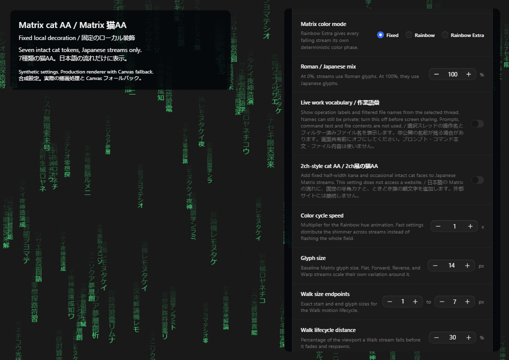
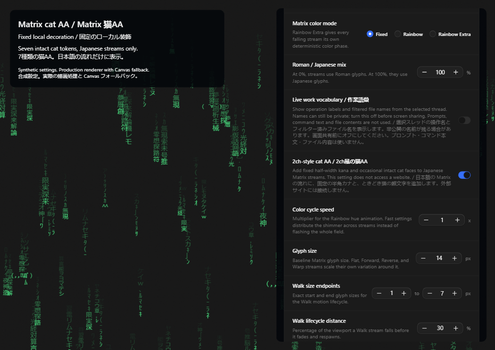

# Matrix cat AA enrichment / Matrix 猫AA装飾

This incremental draft adds Club Code's optional cat AA and half-width kana to the existing Matrix renderer. It is based on the current-dev Matrix runtime and selected-thread vocabulary drafts: [PR 100](https://github.com/John-Ryan21337/club-code/pull/100) and [PR 105](https://github.com/John-Ryan21337/club-code/pull/105). The exact prerequisite is `b996a95a3f385818604a0ec59ebbf172fcae06f9`. [Cafe issue 100](https://github.com/cafeai/cafe-code/issues/100) tracks the proposal. No upstream merge is assumed.

この差分は、既存の Matrix 描画に Club Code の任意の猫AAと半角カナを追加します。前提は上記の Matrix 描画と選択スレッド語彙のドラフトです。上流への統合はまだ行われていません。

## Use / 使い方

The server must expose the existing atmosphere capability. In Window atmosphere, enable falling effects, select Matrix, then enable **2ch-style cat AA / 2ch風の猫AA**. The setting defaults to off. The Japanese stream ratio determines which streams can use the decoration; a 0% Japanese ratio displays none. Reset restores the setting to off.

サーバーで既存の背景効果機能が有効になっている必要があります。「Window atmosphere」で背景効果を有効にし、Matrix を選び、**2ch-style cat AA / 2ch風の猫AA**をオンにします。既定値はオフです。日本語の流れの比率が対象を決めます。日本語が0%の場合は表示しません。リセットするとオフに戻ります。

## Rendering / 描画

The setting adds a fixed pool of half-width kana and symbols. Each Japanese stream has an 8% selection probability for one of seven intact cat tokens at its head. This is a selection probability, not a guarantee that 8% of visible heads contain a cat. Work vocabulary keeps priority when both features select the same head. Tail cells remain individual glyphs.

固定の半角カナと記号を追加します。日本語の各流れは、8%の確率で7種類の猫AAのいずれかを先頭に選びます。これは選択確率であり、表示中の先頭の8%が常に猫になるという意味ではありません。同じ先頭に作業語彙が選ばれた場合は、作業語彙を優先します。後続の文字は1文字ずつです。

```text
∧＿∧   ( ´∀｀)   (・∀・)   (=ﾟωﾟ)ﾉ   （´・ω・｀）   ∧∧   (,,ﾟДﾟ)
```

Canvas and GPU collection use the same drawing traversal, including all six motion modes. The GPU atlas contains each complete token. The existing limits remain: 640 streams, 8,192 collected GPU instances, bounded backing pixels and atlas size; ordinary non-Walk tokens have an 18px font cap and a 144px width cap. Walk modes retain their existing proportional fitting and occupancy rules. Font appearance can differ by platform.

Canvas と GPU は、6種類の動きを含め、同じ描画処理を使います。GPU の文字画像には顔文字全体を登録します。既存の上限を維持します。流れは640本、収集する GPU 文字は8,192個で、描画領域と文字画像にも上限があります。Walk 以外の顔文字は文字サイズ18px・幅144pxまでです。Walk は既存の縦横比調整と重なり制御を使います。フォントの見た目は環境によって異なる場合があります。

Toggling the setting changes decorative text in place. It does not restart particle positions, velocities, or lifecycle progress. Old text is removed before paint, including with a queued animation frame or reduced motion. Hidden-window and focus policies remain authoritative. Rain and snow do not use this text.

切り替えは装飾文字だけを更新し、粒子の位置・速度・進行状態を初期化しません。描画待ちのフレームがある場合や動きを減らす設定でも、古い文字を次の表示前に消します。非表示・フォーカスの制御を維持します。雨と雪はこの文字を使いません。

## Scope and evidence / 範囲と確認

The glyphs and tokens are fixed local source data. No website, account, external feed, prompt, file content, or command is read for this decoration. Shared settings use the existing acknowledged settings path. This base does not include the atmosphere console or profile importer; their enrichment command and appearance-profile integration need a separate integration change. Full provider activity routes and music response are separate features.

文字と顔文字は固定のローカルデータです。この装飾のために、サイト・アカウント・外部フィード・プロンプト・ファイル内容・コマンドを読みません。共有設定は既存の確認済み設定更新処理を使います。この前提ブランチには背景コンソールやプロファイル取り込みが含まれません。それらの装飾コマンド・外観プロファイルとの統合は別の変更が必要です。プロバイダーの活動経路と音楽への反応も別機能です。

Synthetic tests cover opt-in persistence, the selection threshold, intact tokens in all six projections, work-label priority, Roman-only behavior, settings reset, and clearing without reseeding under reduced motion and an active animation frame. The screenshots and video use actual components, the application stylesheet, and synthetic settings. They do not claim physical GPU acceleration.

合成テストは、設定保存・選択確率の境界・6種類の投影での顔文字全体の表示・作業語彙の優先・日本語0%・設定リセット・動きを減らした場合と描画待ちフレームがある場合の消去を確認します。画像と動画は実際の部品・スタイル・合成設定を使います。物理 GPU による高速化を確認したという意味ではありません。

Independent source review passed without repairs. The final repository test graph passed all 10 tasks; the server reported 2,004 passes and one existing platform skip. The complete Chromium suite passed 334 tests. Formatting, lint, and all 10 typecheck tasks passed. A first-run Electron dependency extraction race in this isolated checkout was resolved by completing the package installation serially before the final graph. No application source workaround or timeout increase was added.

独立したソースレビューは修正なしで合格しました。最終のリポジトリテストは10タスクすべて合格し、サーバーは2,004件合格・既存の環境依存スキップ1件でした。Chromium は334件、整形・lint・10タスクの型検査も合格しました。隔離作業ディレクトリでの初回 Electron 展開の競合は、依存パッケージの準備を直列に完了してから最終テストを実行して解消しました。アプリの回避処理や待機時間の引き延ばしは追加していません。





[Interaction video / 操作動画](pr-assets/matrix-cat-enrichment/interaction.webm)

The forced desktop build passed all three tasks. The generated server and renderer bundles contain the new setting. The 9.84-second video was decoded and a frame was inspected.

強制デスクトップビルドは3タスクすべて合格しました。生成されたサーバーと画面のバンドルに新しい設定を確認しました。9.84秒の動画を再生処理し、実際のフレームを確認しました。
