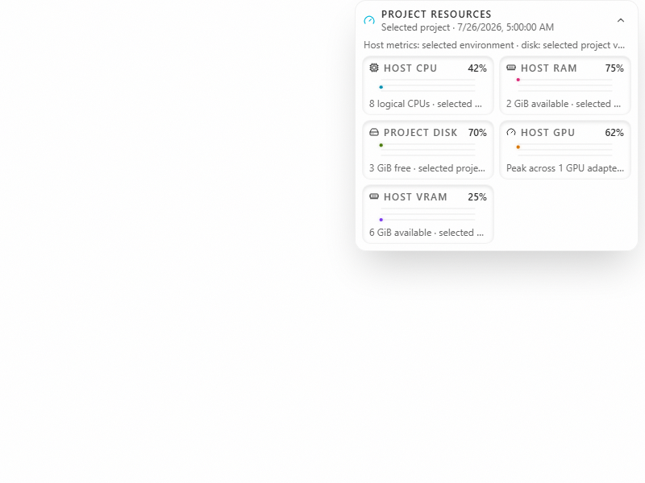
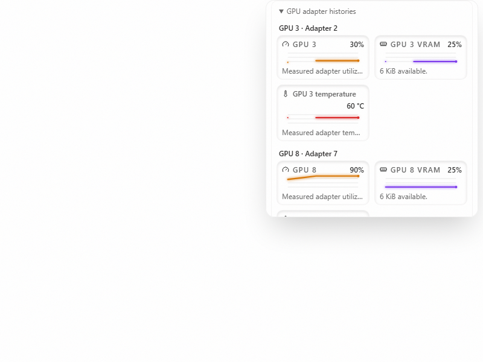

# Per-GPU histories

Expand **Resources**, then **GPU adapter histories** to see each reported GPU's utilization, VRAM usage, and optional temperature. The host peak-utilization and combined-VRAM cards remain available above the adapter list.

This incremental draft depends on the temperature-category history slice for its shared card and bounded scrollable panel, and on the GPU backend adapter below that stack. It ports Club Code's per-adapter presentation into Cafe without adding a probe, timer, provider dependency, or device control.

| Before                                                       | After                                                              |
| ------------------------------------------------------------ | ------------------------------------------------------------------ |
|  |  |

The images use synthetic adapters. [Short interaction video](pr-assets/per-gpu-history/interaction.webm) shows an adapter disappearing and returning in a different response order. No physical GPU was tested.

Cards and histories use the source adapter index, with a one-based display label. Reordering the response does not change identity, and a missing sample adds a gap for that adapter. Duplicate indexes or invalid adapter data suppress the detail list. Missing temperature or inconsistent memory values remain unavailable; utilization can still be shown when only memory is inconsistent.

This is a short in-memory history of reported indexes, not a durable physical-device identity map. NVIDIA [does not guarantee the same enumeration order across reboots](https://docs.nvidia.com/deploy/nvidia-smi/). The current probe does not return UUIDs or PCI bus IDs, so a reused index after a driver or hardware change can refer to another device. Changing project/environment targets or unmounting the resource panel clears its history.

Temperature graphs use the same fixed −20 to 120 °C scale as category histories; numeric labels retain the reported value. The existing poll owner and bounded buffer are reused. No hardware names are sent to a new endpoint or stored in a persistent history. Other GPU source and platform limits are described in [the GPU adapter guide](host-gpu-telemetry-adoption.md).

Track adoption in [Cafe issue #82](https://github.com/cafeai/cafe-code/issues/82). Model and browser checks cover independent adapter values, reordering, disappearance, gaps, duplicate indexes, unsafe names, missing temperatures, and inconsistent memory.
