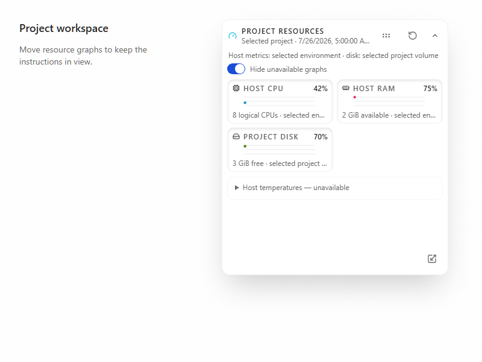

# Resource panel layout

Expand **Resources** to move or resize the panel over the chat timeline. Drag the move handle in the header or the resize handle in the footer. Focus either handle and press an arrow key for an 8-pixel step, or Shift+Arrow for a 1-pixel step. **Reset resource graph position and size** restores the default geometry.

The panel stays within the chat area when that area shrinks. Its header and footer remain available while the graph body scrolls. The overlay can cover messages; moving or collapsing it reveals them. It does not reduce the timeline's layout height.

| Before                                                                               | After                                                                          |
| ------------------------------------------------------------------------------------ | ------------------------------------------------------------------------------ |
|  |  |

The images and [short interaction video](pr-assets/resource-panel-layout/interaction.webm) use synthetic telemetry. They do not test physical hardware.

Position and size are saved in this browser profile under `cafe-code:project-telemetry-panel:v1`. The default position is calculated from the current chat bounds. Invalid or oversized saved data falls back to that default. If local storage is blocked or full, the controls continue to work in memory. Reset removes only the saved geometry.

**Hide unavailable graphs** removes cards that have no current measurement, including unavailable temperature categories and per-GPU metrics. Available measurements and sensor diagnostics remain visible. This setting defaults to off and uses Cafe's existing client-settings persistence. It does not change the probes, request interval, history buffer, or provider work. The existing collapsed-panel behavior still stops future telemetry polls.

This incremental draft depends on the per-GPU history slice and its shared resource cards. It adds no hardware probe or persistent metric history. Existing adapter, category-history, and physical-device identity limits still apply. Track adoption in [Cafe issue #82](https://github.com/cafeai/cafe-code/issues/82).

Browser checks cover pointer and keyboard controls, saved geometry, smaller chat bounds, reset, unavailable-card filtering, storage failures, and unchanged polling and timeline dimensions. Pure geometry and settings tests cover finite bounds and the default-off setting.
