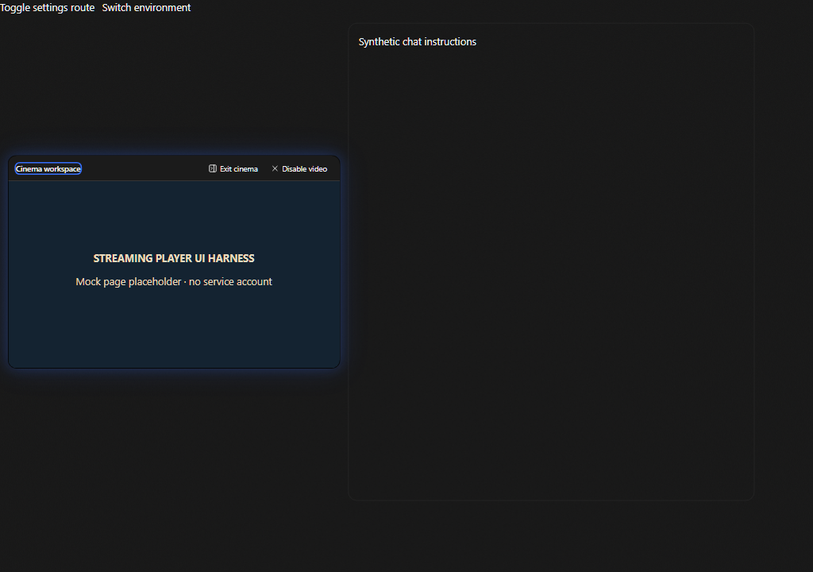

# Streaming player workspace

This incremental slice connects the existing media settings and saved YouTube queue library to a renderer player. Its prerequisite branch is `adoption/media-player-prerequisites-20260911` at `9cbc7c30`, based on current Cafe `dev` at `99fbaec8` plus the exact heads of [media/profile contracts #53](https://github.com/cafeai/cafe-code/pull/53) and [queue settings #60](https://github.com/cafeai/cafe-code/pull/60). The latter includes the earlier queue assets, parser, catalog and saved library slices. Those implementations are reused, not replaced.

The prerequisite compatibility patch retains the frozen v1/v2 profile key arrays, explicitly drops only the two diff settings retired by current Cafe, and excludes new Cafe controls from old profile authority. The separate ambient-image slice must use this same media contract definition when the branches are combined.

## Use

Open **Settings → Ambiance → Streaming player**. Paste a supported YouTube or Spotify link and select **Load player**. Return to chat to mount the player if this app session has no previous chat layout. The settings save a canonical service ID, not the original URL or its query parameters. The selected service can require an explicit press of its own Play button. Use **Clear** to remove the saved source and stop the embed.

The player stays mounted when you open settings and return to chat. Move and resize controls also accept arrow keys and save device-local geometry. Cinema places the player beside chat when enough space is available; Escape restores the floating layout. A narrow YouTube layout preserves its minimum viewport, while an unavailable layout unmounts playback. Windows cinema keeps controls below the native caption buttons.

Imported queues remain in the existing saved library. **Play** starts an in-memory queue for the current environment. Previous, Next and Stop control that session. A recognized ended or unplayable event advances once; repeated or stale frame events cannot skip the next item. Playback stops after the final item. Queues do not restart after a reload or environment switch.

Player glow can use a fixed color or bounded public YouTube artwork. Artwork requests omit credentials, reject redirects, have a deadline and a response-size bound. Spotify uses the fixed color. Disable adaptive glow to avoid these artwork requests.

## Boundaries and limitations

The renderer constructs only `youtube-nocookie.com` and `open.spotify.com` embed URLs from validated IDs. Sandboxed cross-origin frames have no Cafe preload or application bridge and cannot navigate the top-level window. Playlist/queue messages must come from the current frame window and exact expected origin. The direct message protocol is not a stable public YouTube API; a service change can disable custom queue/playlist controls. Native embed controls remain available. YouTube requires a viewport of at least 200 by 200 pixels. See the [YouTube iframe documentation](https://developers.google.com/youtube/iframe_api_reference) and [Spotify embed documentation](https://developer.spotify.com/documentation/embeds).

Environment changes replace the frame and discard queue playback. This is a DOM and playback boundary, not a browser cookie partition. Third-party service storage can persist in the renderer session; this slice neither reads service account data nor provides isolated account login or OAuth. Do not treat frame replacement as account logout. Remote playback availability, account access and autoplay are controlled by the service.

Search/discovery, OAuth connections, local media/VLC, local audio capture and music-reactive atmosphere are separate follow-ups. This slice does not claim those features are installed. The independent Agent Browser uses its own native tab partitions and origin-sharing controls.

## Verification and review media

The browser fixtures check the actual workspace and settings components, with controlled settings and synthetic load events. They cover disabled startup, canonical source selection, frame retention and replacement, geometry controls, cinema, and cleanup when the layout becomes too small. Unit tests separately check message boundaries, queue revisions, parsing, geometry persistence and artwork limits.

A separate opt-in check used a fresh Chromium context and the production transport helper against YouTube's public iframe example. The real frame returned its ready acknowledgement. Autoplay was denied, the URL requested mute, and the check sent no playback commands. This confirms the initial service handshake at the time of the check. It does not verify audible playback, terminal events, playlist availability or account access.

These images show the actual components with a labelled mock page. They are UI evidence and do not show a real service account or prove remote playback.

[Floating player](images/streaming-player/floating-ui-harness.png) · [Settings beside the retained player](images/streaming-player/settings-ui-harness.png)
