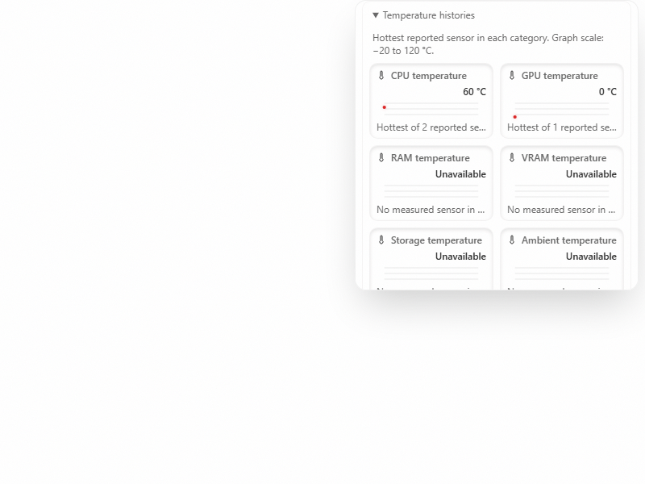

# Temperature category histories

Expand **Resources**, then **Temperature histories** to see recent CPU, GPU, RAM, VRAM, storage, ambient, and other sensor temperatures. Each category uses its hottest reported sensor and shows how many sensors contributed. The separate **Host temperatures** list retains the individual sensor labels and values.

This incremental draft depends on the host-temperature adapter slice. It adds Club Code's category-history behavior to Cafe's existing project resource panel. Panel movement, resizing, per-GPU cards, and the hide-unavailable preference remain separate adoption work.

| Before                                                                       | After                                                                               |
| ---------------------------------------------------------------------------- | ----------------------------------------------------------------------------------- |
|  |  |

These images use synthetic responses. [Short interaction video](pr-assets/temperature-category-history/interaction.webm) shows the category disclosure and a project change. No physical sensor was tested.

The graph uses a fixed scale from −20 to 120 °C. Readings outside that scale use the graph edge; the label retains the measured value. A measured zero or negative temperature remains a measurement. A missing category stays **Unavailable**. The component does not infer temperature from utilization.

History uses the existing bounded sample buffer and poll owner. Switching projects or environments clears the prior target's history. A failed read clears current values and adds a history gap. Collapsing Resources or hiding the document pauses polling; opening the category disclosure does not create a new timer or probe. The expanded panel has a bounded height and scrolls to keep the rest of the chat usable.

The category projection rejects malformed, oversized, or out-of-range sensor lists from injected adapters. It does not use transport error text for card labels. Local UI history is not a persistent sensor archive and is cleared when the component unmounts. A category's hottest sensor can change between samples, so a line is a category maximum over time, not the history of one physical probe. The source adapter and operating-system limits remain in the [host temperature guide](host-temperature-telemetry-adoption.md).

Track this adoption in [Cafe issue #82](https://github.com/cafeai/cafe-code/issues/82). Checks use synthetic response sequences, including zero, negative values, multiple sensors, target changes, and failed reads.
