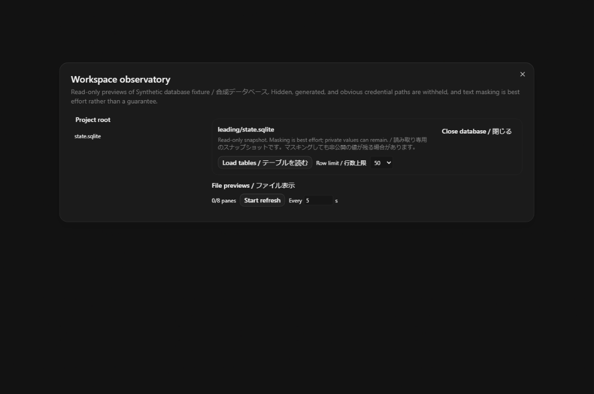
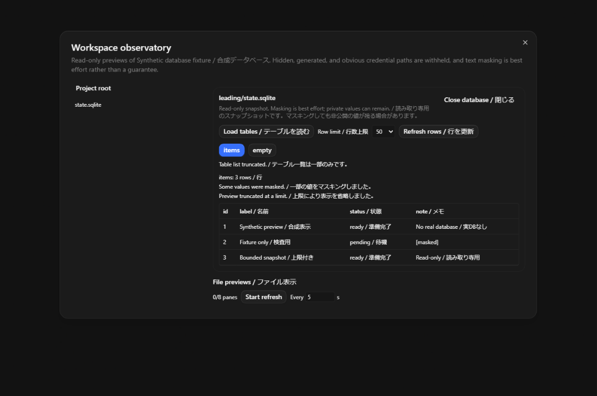

# Workspace SQLite previews / 作業領域の SQLite 表示

This incremental draft adds database tables and rows to [Cafe's file observatory draft94](https://github.com/cafeai/cafe-code/pull/94), exact `67d19445cf880298585a31bdcb25cc6c30543920`. [Cafe issue104](https://github.com/cafeai/cafe-code/issues/104) tracks the port. It preserves the current Cafe provider APIs and package versions.

この差分は上記のファイル観測ドラフトに、データベースのテーブルと行の表示を追加します。現行 Cafe のプロバイダー API とパッケージ版を保持します。

Open Workspace observatory for a project. In its directory tree, select a `.db`, `.sqlite` or `.sqlite3` file, then select **Load tables / テーブルを読む**. Select a table to read its rows. The row limit is 25, 50 or 100; the default is 50. **Refresh rows / 行を更新** takes another snapshot. Reads are explicit. The database view does not poll, run user SQL, or change data.

プロジェクトの Workspace observatory を開きます。ディレクトリ一覧で `.db`、`.sqlite`、`.sqlite3` ファイルを選び、**Load tables / テーブルを読む** を押します。テーブルを選ぶと行を読み取ります。行数上限は25・50・100で、初期値は50です。**Refresh rows / 行を更新** で再取得します。操作したときだけ読み取り、定期取得・任意の SQL 実行・データ変更は行いません。

The server resolves the selected project's root and checks it again before returning a snapshot. A moved or removed project is refused. It preserves exact filename spelling, including leading spaces, and applies the existing path, symlink, hidden-file and sensitive-name checks. Changing the project or database clears the previous view. Replacing the connection hides the database preview name and values and requires reopening the observatory. The existing directory tree and file panes are separate surfaces. Their refresh controls apply to file previews only. Failures show a fixed message; raw SQLite errors, paths and row values do not enter diagnostics.

サーバーが選択プロジェクトのルートを解決し、結果を返す前に再確認します。移動または削除されたプロジェクトは拒否します。先頭の空白を含む正確なファイル名を保持し、既存のパス・リンク・隠しファイル・機密名の検査を適用します。プロジェクトやデータベースを変えると前の表示を消します。接続が置き換わった場合はデータベース表示の名前と値を隠し、観測画面を開き直す必要があります。既存のディレクトリ一覧とファイル表示は別の領域であり、その更新操作はファイル表示だけに適用します。失敗時は固定メッセージを表示し、生の SQLite エラー・パス・行の値を診断へ出しません。

## Read boundary / 読み取りの制限

- Main database: at most 32 MiB. Optional WAL: at most 16 MiB. A rollback journal, changed file identity or changed file metadata causes refusal. A bounded private copy is read; SQLite never opens the original project database. Its temporary sidecars stay in the owned temporary directory and are removed after the child closes.
- The fixed child has a three-second deadline and a 256 KiB output ceiling. It has no inherited provider credentials or Node hooks, no extension loading and no user SQL. The existing four-operation pool bounds admitted work; its five-second waiter retains the slot until the underlying work settles. The UI has a separate 20-second waiter. Closing or timing out the UI does not prove cancellation of an accepted server request.
- Only ordinary tables are listed, up to 200. Views, virtual/shadow tables, SQLite internal tables and obvious credential table names are withheld. Generated/hidden columns are omitted. Rows have at most 40 columns, 100 rows and 4,096 characters per cell, with a total encoded result limit. Blobs are omitted. Limits and omitted columns can mark the preview as truncated.
- Obvious credential columns and common key/value settings are masked, followed by the file observatory's text masking. Masking is best effort: private values can remain. Treat the view as private project data, including when sharing a screen.
- Snapshots are convenient reads, not SQLite's atomic backup protocol. A concurrent writer can cause refusal. Portable path and metadata checks do not provide a sandbox against a hostile writer who already controls the workspace. Row order is not guaranteed; this slice does not infer edits, authors, primary-key identities or causal activity from row positions.

本体は32 MiB、任意の WAL は16 MiBまでです。ロールバック用ジャーナルがある場合や、ファイルの識別情報・更新情報が変わった場合は拒否します。専用の一時コピーだけを SQLite で開き、元のプロジェクトデータベースは開きません。一時的な補助ファイルは専用ディレクトリ内に置き、子プロセス終了後に削除します。

固定の子プロセスは3秒、出力は256 KiBまでです。プロバイダー認証情報や Node フックを継承せず、拡張機能や任意の SQL を読み込みません。既存の同時処理上限は4件です。サーバーの待機は5秒ですが、実処理が終わるまで枠を保持します。画面の待機は別に20秒です。画面を閉じることや待機の時間切れは、受理済みサーバー要求の中断を証明しません。

通常のテーブル200件までを表示します。ビュー・仮想テーブルと補助テーブル・SQLite 内部テーブル・明らかな認証情報テーブルは表示しません。生成列と隠し列を省略し、40列・100行・セル4,096文字と結果全体の上限を適用します。バイナリ値も省略します。上限や列の省略は表示に示します。

明らかな認証情報の列と一般的なキー・値の設定をマスキングし、既存のテキストマスキングも適用します。ただし非公開の値が残る場合があります。画面共有時も非公開のプロジェクトデータとして扱ってください。

これは便利な参照用スナップショットであり、SQLite の原子的なバックアップ処理ではありません。同時更新中は読み取りを拒否する場合があります。移植可能なパスと更新情報の検査は、既に作業領域を制御する悪意ある書き込み相手へのサンドボックスではありません。行の順序を保証せず、行位置から編集・作者・主キー・原因となる活動を推測しません。

## Scope and evidence / 範囲と検証

Club's global application-state database entry, database discovery across the whole tree, automatic row comparisons and workflow activity views are separate gaps or drafts. They are not silently mapped to arbitrary server paths. This slice covers explicit SQLite files within the selected project.

Club のアプリケーション全体の状態データベース、ツリー全体の自動探索、行の自動比較、ワークフロー活動の表示は別の未対応部分またはドラフトです。任意のサーバーパスへ暗黙に対応付けません。この差分は、選択プロジェクト内で明示的に選んだ SQLite ファイルを対象にします。

Tests create synthetic SQLite files, including a live WAL fixture, and exercise actual authenticated WebSocket requests. Process tests verify timeout/abort/output rejection, closed input, stripped environment and waiting for child close. Browser tests use synthetic rows. No real user database, account or provider is used.

テストは WAL を含む合成 SQLite ファイルを作成し、実際の認証付き WebSocket 要求を確認します。プロセステストでは時間切れ・中断・出力上限・入力終了・環境の制限・子プロセス終了待ちを検査します。画面テストの行も合成データです。実ユーザーのデータベース・アカウント・プロバイダーは使いません。

[Synthetic interaction recording / 合成データでの操作動画](pr-assets/workspace-databases/interaction.webm)
